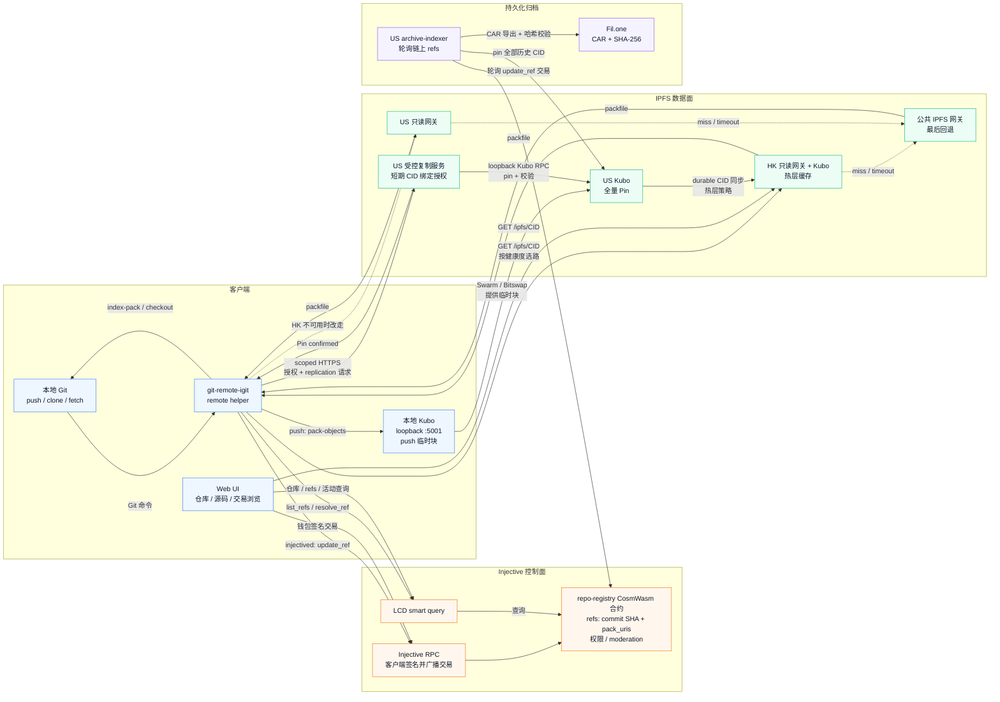

# Next Injective Git（`igit`）

[](https://gitee.com/haohanyh_0591/next-injective-git)

[](#license)
[](cli/go.mod)
[](contracts/repo-registry/Cargo.toml)
[](https://testnet.explorer.injective.network/contract/inj1mg6x7ht3zyyszed9aq67q6kd0y5rtq7wf756jh)


**Next Injective Git** 是去中心化代码协作平台：Git 对象存 IPFS，仓库元数据与 refs 记录在 Injective 链上的 CosmWasm 合约中。项目提供 CLI **`igit`**、Git remote helper **`git-remote-igit`** 和浏览器端 Web UI，可通过原生 Git 工作流或钱包完成链上协作。

```
igit init my-repo "hello chain"
igit push inj main
igit clone igit://alice/my-repo
```

> **当前状态：Injective testnet（`injective-888`）**
> 已部署合约：[`inj1mg6x7ht3zyyszed9aq67q6kd0y5rtq7wf756jh`](https://testnet.explorer.injective.network/contract/inj1mg6x7ht3zyyszed9aq67q6kd0y5rtq7wf756jh)。Clone / Fetch 已公开可用；Push 还需要本地 Kubo、`injectived` 和运营方签发的上传身份令牌。

## 核心能力

- **Git 原生兼容**：支持 `push`、`clone`、`fetch`、`pull`，也可直接使用 `igit://owner/repo` remote。
- **链上协作**：仓库与 refs、协作者权限、所有权转移、内容治理均由 `repo-registry` 合约管理。
- **社区功能**：支持用户名、Fork、项目赞助、收入分配与不可转让的贡献 Badge。
- **Web 浏览**：直接从 Injective 和 IPFS 读取仓库、源码、提交、Diff、交易和 CID，无中心化应用后端。
- **多层持久化**：US Kubo 保存全量 Pin，HK 提供大陆可达的热层网关，Fil.one 保存经过 SHA-256 校验的 CAR 归档。

## 架构一览



- **Push 顺序**：本地生成增量 pack → 本地 Kubo 临时 `add` → US 复制服务 Pin 并校验 pack SHA-256 → 客户端签名 `update_ref` 写入链上；链上确认后才回收临时块。
- **Clone / Fetch 顺序**：先从合约读取 `refs` 与 `pack_uris`，再通过 HK 网关读取；按健康检查回退 US 网关，最后才使用公共网关。本地没有 Kubo 也能读取。
- **持久化职责**：US Kubo 保存全量 Pin，`archive-indexer` 将链上引用的 pack 导出到 Fil.one CAR；HK 只做热层缓存，不承担写入确认。

## 目录结构

| 路径 | 说明 |
|---|---|
| `contracts/repo-registry/` | CosmWasm 合约（Rust）：仓库、refs、权限、Fork、赞助、Badge 与用户名 |
| `cli/` | Go：`igit`、`git-remote-igit` 与 US 受控复制服务 |
| `web/` | React + Vite Web UI：仓库浏览、钱包交易、Injective / IPFS Explorer |
| `scripts/` | Testnet 部署、端到端测试、网关、复制、归档与监控脚本 |
| `docs/` | 架构、基础设施、安全决策与开放问题 |

## 快速开始

### 依赖

- Git（`igit` 委托 Git 生成和导入 packfile）
- Go 1.22+（从源码安装 CLI）
- Node.js + npm（仅开发 Web UI）
- Push 额外需要 [Kubo](https://docs.ipfs.tech/install/command-line/) 和 [injectived](https://docs.injective.network/)；Clone / Fetch 不需要二者
- 编译合约需要 **Rust 1.81.0** 和 `wasm32-unknown-unknown` target；Injective VM 会拒绝新工具链生成的 reference-types / bulk-memory 指令
- Windows 没有原生 `injectived`，需要 Push 或部署合约时请在 WSL2 中运行整套工具链

### 1. 安装 CLI

```bash
cd cli
go install ./cmd/igit ./cmd/git-remote-igit
igit version
```

`igit` 和 `git-remote-igit` 都必须在 `PATH` 中。若安装后找不到命令，请将 `go env GOPATH` 下的 `bin` 目录加入 `PATH`。

### 2. Clone 公开演示仓库

```bash
igit config set contract_address inj1mg6x7ht3zyyszed9aq67q6kd0y5rtq7wf756jh
igit clone igit://hny0305lin/demo-showcase
```

该流程只通过 LCD 和只读 HTTPS 网关访问 Injective / IPFS，不需要链上密钥、本地 Kubo 或上传授权。

### 3. 创建并 Push 仓库

创建 testnet key，并到 [Injective testnet faucet](https://testnet.faucet.injective.network/) 领取测试 INJ 作为 gas：

```bash
igit key new dev
igit key show                                  # 显示需要充值的 inj1... 地址
```

Push 使用受控复制服务。当前上传身份令牌与 US Kubo Swarm 地址由项目运营方提供，尚未开放匿名或自助签发；未获得这两项配置时仍可正常 Clone / Fetch。

```bash
igit config set upload.authorization '<operator-issued-identity-token>'
igit config set upload.us_peer '<US-Kubo-swarm-multiaddr>'

# 终端 A：保持本地 Kubo 运行
ipfs daemon
```

```bash
# 终端 B：创建链上仓库并推送现有本地仓库
igit init hello "my first on-chain repo"
REMOTE=$(igit clone-url hello)

cd my-project
igit remote add inj "$REMOTE"
igit push inj main
```

> `igit push` / `igit clone` / `igit pull` 是对 `git` 的轻包装——你只用 `igit` 一个命令即可；
> 原生 `git push` / `git clone igit://...` 同样有效（走 `git-remote-igit` 助手）。

从 GitHub 一键迁移现有仓库（全部分支 + tag 镜像上链）：

```bash
igit import github.com/user/repo          # 镜像到 igit://<你的地址>/repo
igit import github.com/user/repo my-name  # 自定义链上仓库名
```

### 常用链上协作命令

```bash
igit username register alice                    # 注册可读的 igit://alice/... 用户名
igit collab add hello inj1... maintainer         # 添加仓库维护者
igit fork <owner> <repo> [new-name]              # Fork 到自己的命名空间
igit sponsor <owner> <repo> 0.5 "great work"    # 赞助项目
igit badge award hello <recipient> "fixed CI"   # 颁发贡献 Badge
igit splits set hello <address>:2000             # 设置 20% 赞助收入分配
```

## 自行部署合约（维护者）

必须使用 Rust 1.81.0 编译链上 Wasm；`Cargo.lock` 已固定兼容依赖，请保留 `--locked`。

```bash
rustup toolchain install 1.81.0
rustup target add --toolchain 1.81.0 wasm32-unknown-unknown

cd contracts/repo-registry
cargo +1.81.0 test --locked
cargo +1.81.0 build --release --target wasm32-unknown-unknown --lib --locked

injectived tx wasm store target/wasm32-unknown-unknown/release/repo_registry.wasm \
  --from mykey --chain-id injective-888 \
  --node https://testnet.sentry.tm.injective.network:443 \
  --gas auto --gas-adjustment 1.4 --gas-prices 500000000inj --yes

# testnet 保留单签 admin 以便迁移；主网应改为多签 + 时间锁
ADMIN=$(injectived keys show mykey -a)
injectived tx wasm instantiate <CODE_ID> '{"admin":"'$ADMIN'"}' \
  --label igit-repo-registry --admin "$ADMIN" --from mykey ... --yes
```

也可用 `scripts/testnet-deploy.sh <store交易hash>` 完成 instantiate 和 CLI 配置；`scripts/testnet-e2e.sh` 用于真实 testnet + IPFS 端到端回归。

## 工作原理

- **push**：`git-remote-igit` 生成增量 packfile → 本地 Kubo `add?pin=false` 临时加入并通过 Swarm 提供给 US → 受控复制服务确认 US Kubo 全量 Pin 且校验 pack SHA-256 → `injectived` 签名广播 `update_ref`。只有交易成功后才执行本地 IPFS GC；交易失败会保留临时块以便重试，US 未上链 Pin 按 TTL 回收。
- **clone/fetch**：LCD 查询合约 `list_refs` / `resolve_ref` → 先探测 HK/US `/healthz` 并按延迟排序 → 仅通过 HTTPS `GET /ipfs/<cid>` 下载（失败再回退公共网关）→ `git index-pack` 注入本地对象库；本地没有 Kubo 也能完成。
- **权限**：owner 可管理协作者（Maintainer 可推送、Reader 只读标记）、转移所有权；内容委员会（未设时为 admin）可设置 `moderation_status`，Frozen 状态下合约拒绝一切 ref 写入。

详细写入状态机和安全边界见 [目标拓扑与迁移方案](docs/target-topology-migration.md)；未决设计见 [开放问题](docs/open-questions.md)。

## 开发

```bash
# 合约
cd contracts/repo-registry && cargo +1.81.0 test --locked

# CLI
(cd cli && go test ./... && go vet ./...)

# Acceptance fixtures (from the repository root)
bash scripts/feegrant-policy-gate-test.sh
bash scripts/feegrant-issue-test.sh
bash scripts/feegrant-record-push-test.sh
bash scripts/gateway-fallback-acceptance.sh
bash scripts/replication-reaper-test.sh
bash scripts/replication-config-check-test.sh
bash scripts/schedule-upgrade-test.sh
bash scripts/mainnet-governance-check-test.sh

# Web UI
cd web && npm ci && npm run build
# 本地开发：npm run dev
```

## IPFS 网关与临时上传

CLI 默认健康探测香港 `https://igit-hk.haohanyh.ovh` 与美国 `https://igit-us.haohanyh.ovh`。读取不启动、不依赖本地 Kubo，按 `/healthz` 延迟排序后使用只读 HTTPS 网关，并继续回退公共 IPFS 网关。

```bash
igit gateway status                 # 查看两地健康和延迟
igit gateway select                 # 查看当前自动选路顺序

# Push-only configuration. endpoint 已有默认值，通常无需修改。
igit config set upload.authorization '<operator-issued-identity-token>'
igit config set upload.us_peer '<US-Kubo-p2p-multiaddr>'
```

`igit` 只访问本机 loopback 上的 Kubo RPC；HK/US Kubo 管理 API 从不暴露给普通用户。Push 会以运营方签发的 identity token 换取与 CID、仓库、ref、pack SHA-256 和有效期绑定的一次性 ticket，该 ticket 不能提交链上交易。没有本地 Kubo 或上传授权时，Clone / Fetch 仍然可用。

## Release artifacts

The tag-based build and its current verification scope are documented in
[docs/release.md](docs/release.md). Checksums are published to GitHub and can
be registered immutably in `repo-registry` with
`scripts/register-release.sh`; clients can verify a local artifact with
`igit release verify <version> <platform> <file>`.

Contract upgrades are announced with `igit upgrade schedule <wasm-sha256>`
and can be inspected with `igit upgrade show`. The contract enforces a 14-day
delay and requires the same hash in the later migration transaction.

## License

Apache-2.0
