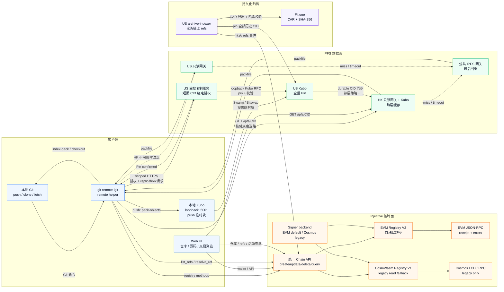

# Next Injective Git（`igit`）

[](https://gitee.com/haohanyh_0591/next-injective-git)

[](#license)
[](cli/go.mod)
[](contracts/repo-registry/Cargo.toml)
[](https://testnet.explorer.injective.network/contract/inj1mg6x7ht3zyyszed9aq67q6kd0y5rtq7wf756jh)


**Next Injective Git** 是去中心化代码协作平台：Git 对象存 IPFS，仓库元数据与 refs 通过统一 Chain API 记录在 Injective 链上。项目提供 CLI **`igit`**、Git remote helper **`git-remote-igit`** 和浏览器端 Web UI；目标是让用户只使用 Git/`igit`，不需要理解 EVM、CosmWasm、RPC、ABI 或 signer 实现。

```
igit init my-repo "hello chain"
igit push inj main
igit clone igit://alice/my-repo
```

> **迁移状态（V2-alpha）**：当前公开 testnet 仍使用 CosmWasm V1 合约
> [`inj1mg6x7ht3zyyszed9aq67q6kd0y5rtq7wf756jh`](https://testnet.explorer.injective.network/contract/inj1mg6x7ht3zyyszed9aq67q6kd0y5rtq7wf756jh)。Clone / Fetch 已公开可用；V1 Push 仍需要本地 Kubo 和 `injectived`，V1 读取兼容仍保留。EVM V2 的 repo/ref、协作者角色、repo metadata、stable `repoId` 和 current/historical locator alias 已贯通 Solidity、checked-in ABI、统一 Go backend、remote helper 与 Web 读取路径；CLI 和 Web ownership-transfer 源码路径均已接入统一 V2 行为，但没有已部署合约上的 receipt 验收。独立 Economic module 的 Solidity、Go backend、Web API 与 owner-only revenue-split UI 也已接入；历史 Economic 状态导入仍属于 deferred sections。旧 locator 的写入会返回 `RepoMoved`，不会静默回退或双写。`igit-migrate-v1` 已能生成 deterministic、hash-bound 的离线 plan 和 ABI-checked unsigned calldata manifest；`igit-migrate-v2-run` 已实现 plan-hash 显式确认、严格 manifest 绑定、加密 EVM admin signer、逐笔 gas/receipt/event 检查和不可覆盖的 `prepared -> broadcast -> mined/reverted` 恢复 journal；`igit-migrate-v2-state` 已实现 finalize receipt 固定块的只读 RPC 导出与精确状态比对。合约源码/ABI 也已有 ordered admin import session API，deployment-level controller 已实现 rolling commitment、fresh/same-bytecode replacement 检查和显式 `abortImport` recovery。这些源码与本地 fake-RPC 测试都不是已执行迁移的证据。固定 Foundry v1.7.1 已在本地执行：完整套件 `78/78` 通过，stateful invariant 为 `128 runs / 8,192 calls / 0 reverts`，代表性写入 gas ceiling 为 `7/7` 通过且 `forge test --gas-report` 成功。上述结果仅是本地测试证据，不是部署、真实链上 receipt、真实状态迁移、clean-machine E2E 或安全审查证据；审核后的 V2 部署、真实管理员演练、journal/runner 安全审查、真实链上导出/比对仍未完成。迁移阶段和验收门见 [EVM V2 迁移规范](docs/evm-v2-migration.md)，身份与 transfer 语义见 [repo identity ADR](docs/evm-v2-repo-identity.md)。

## 核心能力

- **Git 原生兼容**：支持 `push`、`clone`、`fetch`、`pull`，也可直接使用 `igit://owner/repo` remote。
- **统一 Chain API**：remote helper 只调用仓库/ref 接口；EVM V2 是目标默认，CosmWasm V1 负责迁移期兼容。
- **链上协作**：当前 V1 已覆盖仓库与 refs、协作者权限、所有权转移和内容治理；V2 已实现 maintainer/reader/none 协作者角色、repo description/default branch 的 owner-only patch，以及 immutable `repoId`、locator alias、`RepoMoved` 和带 7 天 timelock、30 天 acceptance window、target reject/permissionless expire 的 ownership-transfer 合约状态机。同一 repoId 可回到原历史 alias，但 alias 不能被其他 repo 复用。CLI/Web 的 V2 写入失败不会转写 V1；CLI/Web transfer 源码路径已接入统一 backend，独立 Economic module 的 sponsor/revenue-split 路径也已接入 CLI、Web 和 owner UI；bounded fork、guardian/moderation parity、历史 Economic 状态导入和部署后验收仍待完成。
- **社区功能**：支持用户名、Fork、项目赞助、收入分配与不可转让的贡献 Badge。
- **Web 浏览**：直接从 Injective 和 IPFS 读取仓库、源码、提交、Diff、交易和 CID，无中心化应用后端。
- **多层持久化**：US Kubo 保存全量 Pin，HK 提供大陆可达的热层网关，Fil.one 保存经过 SHA-256 校验的 CAR 归档。

## 架构一览



- **Push 顺序**：本地生成增量 pack → 本地 Kubo 临时 `add` → US 复制服务 Pin 并校验 pack SHA-256 → 客户端签名 `update_ref` 写入链上；链上确认后才回收临时块。
- **Clone / Fetch 顺序**：先从合约读取 `refs` 与 `pack_uris`，再通过 HK 网关读取；按健康检查回退 US 网关，最后才使用公共网关。本地没有 Kubo 也能读取。
- **持久化职责**：US Kubo 保存全量 Pin，`archive-indexer` 将链上引用的 pack 导出到 Fil.one CAR；HK 只做热层缓存，不承担写入确认。

## 目录结构

| 路径 | 说明 |
|---|---|
| `contracts/repo-registry/` | CosmWasm V1 legacy 合约（Rust）：旧仓库兼容读取和行为基线 |
| `contracts/evm-v2/` | Solidity EVM V2 alpha：Git 核心 repo/ref、协作者权限、repo metadata、stable identity/locator alias、ownership transfer，以及独立 Badge/Economic modules 与 Foundry 测试 |
| `cli/` | Go：`igit`、`git-remote-igit`、离线 `igit-migrate-v1` planner、可恢复 `igit-migrate-v2-run` admin runner、只读 `igit-migrate-v2-state` receipt-pinned exporter 与 US 受控复制服务 |
| `web/` | React + Vite Web UI：仓库浏览、钱包交易、Injective / IPFS Explorer |
| `scripts/` | V1 testnet、V2 合约检查、迁移 readiness、网关、复制、归档与监控脚本 |
| `docs/` | 目标架构、迁移规范、V1 行为基线、基础设施、安全决策与开放问题 |

## 快速开始

### 依赖

- Clone / Fetch 只需要 Git、`igit` 和 `git-remote-igit`
- 从源码安装 CLI 时需要 Go 1.22+；发布版二进制不需要 Go
- Node.js + npm（仅开发 Web UI）
- 当前 V1 testnet Push 额外需要 [Kubo](https://docs.ipfs.tech/install/command-line/) 和 [injectived](https://docs.injective.network/)；`igit setup push` 会安装经过 SHA-256 校验的锁定版本
- V2-alpha 合约测试使用固定 [Foundry](https://book.getfoundry.sh/getting-started/installation) v1.7.1（`forge`）；没有 `forge` 时迁移检查会明确标记为 `SKIP`
- 编译 V1 legacy 合约需要 **Rust 1.81.0** 和 `wasm32-unknown-unknown` target；V2 使用 Solidity `0.8.24`
- V2 源码已具备 Windows/Linux 原生 signer + Kubo-only setup，不会在 V2 路径检查或安装 `injectived`；当前公开 V1 testnet 仍保留 WSL2 legacy 路径，原生 V2 Push 尚待部署和清洁环境验收

### 目标用户路径（V2 正式版）

迁移完成后，干净的 Windows 或 Linux 环境只需要：

```text
igit setup
igit key new dev
igit key show
igit doctor
igit init <repo>
igit push
igit clone igit://<inj1-address-or-username>/<repo>
igit fetch
```

`setup` 自动选择 network profile、EVM registry、signer 和本地 Kubo；配置文件
只保存 profile/endpoint 元数据。当前 EVM signer 把私钥保存在 scrypt 加密的
geth keystore 中；Credential Manager、系统 keyring 和硬件钱包是后续可替换
signer，不是当前已实现的存储后端。V2 尚未 GA 前，请按下面的
**legacy V1 testnet** 步骤操作，不要把 `contract_version=v2` 手工写入当前生产配置。

`inj1-address-or-username` 是 V2 正式版的目标 URL 契约。当前显式 `evm/v2`
profile 只支持 `inj1...` 或 `0x...` owner；只有 `auto + v2` 兼容模式可以借助
V1 LCD 解析已有 username。V2 username registry 或独立 resolver 上线前，显式
V2 模式下的 username URL 会返回 unsupported。

### 1. 安装 CLI

以下命令是当前 CosmWasm V1 testnet 的 legacy 安装路径。它们用于迁移期回归
和旧仓库操作，并不是 V2 正式版的最终用户体验。当前 CLI 已支持无参数的
`igit setup` 作为默认入口；显式的 `igit setup push` 仍保留为兼容别名。

Windows + WSL2（推荐）可从源码 checkout 一次完成 CLI、Kubo、`injectived` 和 testnet key 的安装：

```powershell
powershell -ExecutionPolicy Bypass -File .\scripts\bootstrap-push.ps1 -Yes -CreateKey dev
```

首次注册 WSL 时脚本会创建普通 Linux 用户；默认名称来自 Windows 用户名，也可用 `-LinuxUser alice` 指定。

已有 WSL 发行版时，正式发布的 Windows `igit.exe` 也支持：

```powershell
.\igit-windows-amd64.exe setup push --wsl Ubuntu-24.04 --yes --create-key dev
```

它会在 WSL2 中安装同版本 Linux CLI，并先用 release `checksums.txt` 校验 `igit` 和 remote helper。Linux 源码 checkout 可运行：

```bash
bash scripts/bootstrap-push.sh --yes --create-key dev
```

只开发或使用 Clone / Fetch 时仍可轻量安装：

```bash
cd cli
go install ./cmd/igit ./cmd/git-remote-igit
igit version
igit doctor --clone
```

`igit` 和 `git-remote-igit` 都必须在 `PATH` 中。若安装后找不到命令，请将 `go env GOPATH` 下的 `bin` 目录加入 `PATH`。

已有 CLI 的 Linux 用户可直接准备 Push 环境：

```bash
igit setup                       # 默认 Push 初始化入口
igit setup push                  # 显式别名，交互确认，不覆盖可工作的现有工具
igit setup push --yes           # 非交互安装
igit setup push --no-kubo       # Kubo 由用户自行管理
igit setup upgrade --yes        # 强制刷新 igit 管理的锁定依赖
igit setup status               # 等价于完整 Push doctor
```

依赖版本、下载地址和 SHA-256 固定在 `cli/internal/bootstrap/deps.json`；托管文件位于 `~/.igit/deps` 和 `~/.igit/bin`。完整行为与排错见 [Push 环境安装](docs/push-setup.md)。

### 2. Clone 公开演示仓库

```bash
igit config set contract_address inj1mg6x7ht3zyyszed9aq67q6kd0y5rtq7wf756jh
igit clone igit://hny0305lin/demo-showcase
```

该流程只通过 LCD 和只读 HTTPS 网关访问 Injective / IPFS，不需要链上密钥、本地 Kubo 或上传授权。

### 3. 创建并 Push 仓库

若 setup 时没有使用 `--create-key`，先创建 testnet key。然后到 [Injective testnet faucet](https://testnet.faucet.injective.network/) 领取测试 INJ 作为 gas：

```bash
igit key new dev
igit key show                                  # 显示需要充值的 inj1... 地址
```

Push 使用受控复制服务。CLI 会从 `https://www.igit.xyz/api/upload-authorization` 自动取得十分钟有效的 Ed25519 身份令牌，并在过期前刷新；US 持久节点和 HK 热层节点的 Swarm 地址已经内置，无需手工复制 Token 或 Peer。

```bash
# setup 会初始化并在后台启动 Kubo；先确认所有硬性检查通过
igit doctor --push

# 创建链上仓库并推送现有本地仓库
igit init hello "my first on-chain repo"
REMOTE=$(igit clone-url hello)

cd my-project
igit remote add inj "$REMOTE"
igit push inj main
```

> `igit push` / `igit clone` / `igit pull` 是对 `git` 的轻包装——你只用 `igit` 一个命令即可；
> 原生 `git push` / `git clone igit://...` 同样有效（走 `git-remote-igit` 助手）。

从 GitHub 一键迁移现有仓库（全部分支 + tag 镜像上链）：

```bash
igit import github.com/user/repo          # 镜像到 igit://<你的地址>/repo
igit import github.com/user/repo my-name  # 自定义链上仓库名
```

### 常用链上协作命令

```bash
igit username register alice                    # 注册可读的 igit://alice/... 用户名
igit repos --all                                # 审计时包含 frozen/delisted 仓库
igit collab add hello inj1... maintainer         # 添加仓库维护者
igit collab list <owner> hello                   # 列出 maintainer/reader
igit collab remove hello inj1...                 # 移除协作者
igit repo edit hello description ""              # 显式清空描述
igit repo edit hello branch release              # 只更新默认分支
igit fork <owner> <repo> [new-name]              # Fork 到自己的命名空间
igit sponsor <owner> <repo> 0.5 "great work"    # 赞助项目
igit badge award hello <recipient> "fixed CI"   # 颁发贡献 Badge
igit splits set hello <address>:2000             # 设置 20% 赞助收入分配
```

公开 profile 目前仍以 CosmWasm V1 处理这些经济命令；EVM sponsor/revenue-split
路径需要已审核的 V2 core/module 地址，失败时不会回退或双写 V1。历史 V1 Economic
状态仍在 `repo_extensions` deferred section，尚未导入 V2。

## 自行部署 CosmWasm V1 合约（legacy 维护者）

本节只用于 V1 testnet 回归、状态导出和迁移准备。新仓库和 V2 部署不得复制
这套 `injectived tx wasm` 流程；V2 合约的本地构建/测试见
[`contracts/evm-v2/README.md`](contracts/evm-v2/README.md) 和
[`docs/evm-v2-migration.md`](docs/evm-v2-migration.md)。

必须使用 Rust 1.81.0 编译链上 Wasm；`Cargo.lock` 已固定兼容依赖，请保留 `--locked`。

```bash
rustup toolchain install 1.81.0
rustup target add --toolchain 1.81.0 wasm32-unknown-unknown

cd contracts/repo-registry
cargo +1.81.0 test --locked
cargo +1.81.0 build --release --target wasm32-unknown-unknown --lib --locked

injectived tx wasm store target/wasm32-unknown-unknown/release/repo_registry.wasm \
  --from mykey --chain-id injective-888 \
  --node https://testnet.sentry.tm.injective.network:443 \
  --gas auto --gas-adjustment 1.4 --gas-prices 500000000inj --yes

# testnet 保留单签 admin 以便迁移；主网应改为多签 + 时间锁
ADMIN=$(injectived keys show mykey -a)
injectived tx wasm instantiate <CODE_ID> '{"admin":"'$ADMIN'"}' \
  --label igit-repo-registry --admin "$ADMIN" --from mykey ... --yes
```

也可用 `scripts/testnet-deploy.sh <store交易hash>` 完成 instantiate 和 CLI 配置；
`scripts/legacy-v1-e2e.sh` 是对会写入真实 testnet 的 V1 + IPFS 端到端回归的
显式 opt-in 入口，不能作为 V2 验收结果。

## 工作原理

- **push**：`git-remote-igit` 生成增量 packfile → 独立 IPFS backend 临时加入并由受控复制服务确认 Pin/SHA-256 → Chain API 按 profile 选择 V2（当前 legacy testnet 为 V1）→ signer 广播交易并等待 receipt。只有交易成功后才执行本地 IPFS GC；交易失败会保留临时块以便重试。
- **clone/fetch**：当前发布的 `auto/v1` profile 直接读取 V1。切换后的 `auto + v2` 兼容 profile 才先查 EVM V2，并且只有 EVM 返回解码后的 typed `LocatorNotFound(address,string)` 时才回退 V1 的 `list_refs` / `resolve_ref`。`RepoNotFound(bytes32)`、`RepoMoved`、`RefNotFound`、权限/解码/RPC 错误都不会触发 V1 fallback。随后探测 HK/US `/healthz` 并按延迟排序 → 仅通过 HTTPS `GET /ipfs/<cid>` 下载（失败再回退公共网关）→ `git index-pack` 注入本地对象库；本地没有 Kubo 也能完成。
- **权限**：owner 可管理协作者（Maintainer 可推送、Reader 只读标记）和 repo metadata；内容委员会（未设时为 admin）可设置 `moderation_status`。Frozen 状态拒绝 ref 更新/删除，但不阻止 owner 修正 description/default branch。

详细链上切换和安全边界见 [EVM V2 迁移规范](docs/evm-v2-migration.md)；IPFS
数据面见 [目标拓扑与迁移方案](docs/target-topology-migration.md)；未决设计见
[开放问题](docs/open-questions.md)。

## 开发

```bash
# CosmWasm V1 legacy 合约
(cd contracts/repo-registry && cargo +1.81.0 test --locked)

# EVM V2（需要 Foundry；没有 forge 时只允许标记为 SKIP）
bash scripts/evm-v2-check.sh --required

# CLI
(cd cli && go test ./... && go vet ./...)
# Linux/CI race gate (requires gcc or clang; local missing compiler is SKIP without --required)
bash scripts/race-check.sh

# Acceptance fixtures (from the repository root)
bash scripts/feegrant-policy-gate-test.sh
bash scripts/feegrant-issue-test.sh
bash scripts/feegrant-record-push-test.sh
bash scripts/gateway-fallback-acceptance.sh
bash scripts/replication-reaper-test.sh
bash scripts/replication-config-check-test.sh
bash scripts/schedule-upgrade-test.sh
bash scripts/mainnet-governance-check-test.sh
bash scripts/v1-export-snapshot-test.sh
bash scripts/migration-readiness.sh

# Windows 原生结构/静态源码检查；跳过 Go/Web/Rust/Foundry 测试
powershell -ExecutionPolicy Bypass -File scripts/migration-readiness.ps1 -SourceOnly

# 迁移操作者：只读导出 V1 快照并打印 SHA-256
bash scripts/v1-export-snapshot.sh --contract inj1... \
  --owners-file owners.txt --output v1-snapshot.json
bash scripts/v1-export-snapshot.sh --validate v1-snapshot.json \
  --hash-file v1-snapshot.json.sha256

# 只生成确定性的、绑定快照哈希的离线 V1 -> V2 计划；不会访问 RPC、签名或广播
(cd cli && go run ./cmd/igit-migrate-v1 \
  --snapshot ../v1-snapshot.json \
  --hash-file ../v1-snapshot.json.sha256 \
  --target-chain-id 1776 \
  --target-contract 0x1111111111111111111111111111111111111111 \
  --output ../v1-import-plan.json \
  --manifest-output ../v1-import-transactions.json)
# plan 仍固定为 executable:false；manifest 只有 unsigned calldata，不签名、不广播。
# 命令会同时打印必须人工复核的 plan sha256。

# 独立复核 plan/manifest hash、scope、deferred sections、target 和交易数；不读 key/RPC。
(cd cli && go run ./cmd/igit-migrate-v2-run \
  --plan ../v1-import-plan.json \
  --manifest ../v1-import-transactions.json \
  --check)

# 仅在审核部署、plan、manifest、管理员地址和 recovery runbook 全部确认后执行。
# runner 要求精确 plan SHA-256，逐笔写入不可覆盖 journal，并可用同一目录恢复。
(cd cli && go run ./cmd/igit-migrate-v2-run \
  --plan ../v1-import-plan.json \
  --manifest ../v1-import-transactions.json \
  --journal ../v2-import-receipts \
  --network injective-mainnet \
  --key migration-admin \
  --acknowledge-core-only-import \
  --confirm-plan-sha256 <printed-plan-sha256>)

# 中断后可先离线检查 journal；不会加载 key 或访问 RPC。真正 resume 仍会重验链上 receipt。
(cd cli && go run ./cmd/igit-migrate-v2-run \
  --plan ../v1-import-plan.json \
  --manifest ../v1-import-transactions.json \
  --journal ../v2-import-receipts \
  --status)

# runner 报告 finalize transaction 后，只读导出该 receipt 固定块的 V2 状态。
# --rpc 仅用于迁移运维覆盖；普通用户不需要配置 RPC。已有输出不会被覆盖。
(cd cli && go run ./cmd/igit-migrate-v2-state \
  --plan ../v1-import-plan.json \
  --finalize-tx 0xaaaaaaaaaaaaaaaaaaaaaaaaaaaaaaaaaaaaaaaaaaaaaaaaaaaaaaaaaaaaaaaa \
  --network injective-mainnet \
  --output ../v2-imported-state.json)

# Web UI
cd web && npm ci && npm run build
# 本地开发：npm run dev
```

## IPFS 网关与临时上传

CLI 默认健康探测香港 `https://igit-hk.haohanyh.ovh` 与美国 `https://igit-us.haohanyh.ovh`。读取不启动、不依赖本地 Kubo，按 `/healthz` 延迟排序后使用只读 HTTPS 网关，并继续回退公共 IPFS 网关。

```bash
igit gateway status                 # 查看两地健康和延迟
igit gateway select                 # 查看当前自动选路顺序

# Push 配置均有内置默认值；只有私有部署才需要覆盖。
igit config list
# 迁移/运维排障才需要底层 backend、RPC 和 legacy 字段
igit config list --internal
```

`igit` 只访问本机 Kubo RPC；HK/US Kubo 管理 API 从不暴露给普通用户。Push 会自动取得短期 identity token，再换取与 CID、仓库、ref、pack SHA-256 和有效期绑定的一次性 ticket；该 ticket 不能提交链上交易。显式的 `upload.authorization`、`upload.us_peer` 与 `upload.hk_peer` 仍可用于私有或离线部署，并可用 `igit config unset <key>` 清除。没有本地 Kubo 时，Clone / Fetch 仍然可用。

## EVM V2 status and key storage

The V2 backend is present in the source tree and covered by local Go/ABI/CLI
and Web API tests. Repository/ref operations, collaborator add/remove/list,
and CLI repository metadata patches now share the Go V1/V2 registry
abstraction. V2 collaborator and metadata writes are single-backend
transactions and do not fall back to V1. The Web metadata path likewise sends
only an EVM transaction and treats a failed receipt as final; it has no
CosmWasm write fallback. V2 setup uses a Kubo-only bootstrap, including the
pinned Kubo v0.42.0 Windows ZIP, and preserves all legacy signer configuration
without invoking `injectived`. This checkout intentionally has no deployed V2
testnet address.
Until a reviewed deployment profile supplies `evm_contract_address`, explicit
V2 setup and writes fail before signing; the legacy CosmWasm address is never
used as an EVM address. Do not work around this by copying an `inj1...` V1
contract address into an EVM field.

For a deployed profile, the normal account flow is:

```text
igit setup
igit key new dev
igit key show
igit doctor
```

EVM keys are encrypted geth-keystore files. By default they live below
`~/.igit/keystore` (or the platform equivalent shown by
`igit config list --internal`);
`config.json` stores only the non-secret key name and profile metadata. The
`IGIT_EVM_KEY_PASSWORD` environment variable is accepted only for isolated
non-interactive automation and must not be committed, logged, or placed in Git
configuration. Interactive use prompts without echoing the password.

Network profile data supplies RPC URL, chain ID, explorer URL, and the reviewed
contract address. Users should not edit RPC, ABI, calldata, nonce, or gas
settings by hand. `auto` keeps V1 read compatibility during migration; new V2
write enablement is a deployment/release gate, not a client-side fallback.

A mined `status=0x0` transaction is written as an immutable `reverted` journal
record. Offline `--status` reports its failed order and receipt hash; resume
does not sign or rebroadcast a replacement for that nonce. The runner verifies
receipt evidence and its canonical block at record/resume time; a missing
receipt, status change, evidence mismatch, or reorg stops resume without a new
signature or broadcast. This is not an implicit Ethereum confirmation-depth
policy. The reviewed migration runbook must state the Injective/CometBFT
finality and RPC consistency assumptions before any real broadcast.
The V2 identity layer now assigns an immutable `repoId` at creation, resolves
current and historical `(owner,name)` locators, and exposes `RepoMoved` for old
locator writes. The Solidity ABI includes the seven-day ownership-transfer
state machine with target reservation, cancel/reject/expire, and O(1) accept;
the Go remote helper and Web route already resolve aliases and surface the
canonical URL. CLI ownership-transfer commands use the unified backend and
stable repo ID. The Web repository route now exposes the same begin, cancel,
reject, accept, expire, and pending-transfer paths over receipt-checked EVM
transactions; the bounded fork implementation is still pending. `igit repos`
and the Web owner view now drain bounded V2 owner-index
pages that return stable `repoId` values. Ref and collaborator lists resolve
the locator once and then drain bounded 64-entry pages by stable `repoId`, with
cursor-progress checks and no V1 fallback after a successful V2 selection or
resolve.
Each V2 multi-page enumeration pins its locator resolution and every page to
one EVM block tag, so owner/ref/collaborator swap-pop changes in later blocks
cannot make a cursor skip an entry.
`updateRepoInfo(string,bool,string,bool,string)` uses explicit patch flags:
an omitted CLI value or Web `undefined` preserves the stored field, while an
empty string with its flag set deliberately clears it. `RepoInfoUpdated`
records a field mask and the final stored values. Frozen repositories retain
this owner-only metadata repair path even though ref writes remain blocked.
The Solidity source and test contracts compile through
`node scripts/evm-v2-solc-check.mjs`, and the checked-in ABI comparison is
currently passing. Fixed Foundry v1.7.1 has executed the complete suite:
`78/78` tests pass; the stateful invariant reports
`128 runs / 8,192 calls / 0 reverts`; and the
representative write gas-ceiling suite passes `7/7`, with `forge test
--gas-report` completing successfully. The Economic module's Solidity tests,
Go sponsor/split/receipt and fixed-block read tests, Web receipt/no-fallback
tests, and owner-only split editor are wired locally. These are local source
and test results only: no V2 deployment, real chain receipt acceptance, real
state migration, clean Windows/Linux Push E2E, or independent security review
has been completed. Historical Economic state import remains deferred.

The checked-in `igit-migrate-v1` command validates a V1 snapshot and SHA-256
sidecar, then publishes a deterministic plan with `executable:false`. Plan and
manifest artifacts use synced temporary files plus no-clobber final links;
existing evidence is never replaced. Both destination names are checked before
publication, and a race that publishes only the plan is reported explicitly as
partial publication so the immutable plan is retained for operator review. With
`--manifest-output`, it also produces deterministic unsigned calldata for the
admin-only `createImportSession`, ordered repo/ref/collaborator batches, and
`finalizeImport` calls. The manifest is bound to the plan SHA-256, snapshot,
target chain/contract, batch sequence, payload hashes, and expected events;
each transaction also carries the ABI-derived expected event topic0. A reviewed
deployment profile may pass `--controller-contract` to route calldata through
the deployment-level controller: lifecycle events come from the controller,
while repo/ref/collaborator batch events come from the registry. The controller
binds the ordered rolling commitment and allows only an explicit pre-release
`abortImport` to a fresh registry with the same runtime code hash. It is not a
production rollback or upgrade path. Go tests decode every transaction with
the checked-in Solidity ABI. The command never contacts RPC, signs, or
broadcasts; the manifest remains `signed:false` and `broadcast:false`.
`--verify-state` can compare a strict imported-state JSON file with the exact
plan, target, repo/ref/collaborator contents, and one immutable numeric EVM
`block_tag`; any mismatch fails before a plan or manifest is written.
`igit-migrate-v2-state` now creates that artifact from an already-mined
finalization transaction. It validates receipt status, target and finalization
event, pins every state call to the receipt block, checks the block hash before
and after pagination, validates `importProgress`, and runs the same exact-state
verifier before exclusively publishing the file. The artifact repeats the
core-only import scope and deferred sections instead of implying full parity.
It never signs, broadcasts,
or overwrites existing evidence. The separate `igit-migrate-v2-run` admin path
requires the exact plan SHA-256, regenerates and compares the full manifest,
uses the encrypted EVM keystore signer, enforces a per-transaction gas ceiling,
and records each signed raw transaction before broadcast in immutable
`prepared`, `broadcast`, and terminal receipt-checked `mined` or `reverted`
files. Resume reuses the same raw bytes and nonce; every terminal receipt is
revalidated against RPC before the runner advances or refuses to resume.
The offline `--status` view labels the signer as journal metadata and does not
claim that chain evidence was revalidated or that local JSON is a signed,
tamper-proof audit record; the execution/resume path instead
binds the header to the encrypted keystore signer and performs the RPC checks.
Because the current contract imports only repo/ref/collaborator core state,
the command also requires `--acknowledge-core-only-import` whenever the plan
lists deferred extension sections; this is not a full V1 feature migration.
Signed raw transactions are broadcastable artifacts, so the journal is mode
0600 and must be archived as sensitive operational evidence. On POSIX, an
error after the transition hard link is published is reported as a typed
"published but unsynced" condition; keep the same directory and reopen it
before retrying. A real run and
security review against a reviewed deployment are still incomplete release
gates; neither the manifest, local fake-RPC tests, nor a hand-authored state
file is evidence that migration ran.

EVM keystore prompts use the controlling terminal (`/dev/tty` on POSIX and
`CONIN$`/`CONOUT$` on native Windows), not the remote helper's stdin/stdout Git
protocol pipes. `IGIT_EVM_KEY_PASSWORD` remains automation-only. In `auto +
v2` compatibility mode, a typed V2 locator miss may expose a V1 repository for
Clone/Fetch only; Push and Delete are rejected before preflight, packing, Kubo,
signing, or broadcast. Explicit `evm/v2` disables LCD fallback entirely.
Selecting a named network replaces every profile-owned chain ID, RPC, explorer,
and contract field together, preventing stale endpoints from another network.

`scripts/migration-readiness.sh` and its PowerShell counterpart are source
readiness gates only. A pass does not mean V2 is deployed or ready for cutover.
The independent `scripts/migration-cutover-readiness.sh` / `.ps1` gate accepts a
reviewed evidence directory only when deployment, Foundry, receipt-journal,
post-import state, clean Windows/Linux/Web E2E, finality runbook, and security
review artifacts are all present, use safe paths, are exactly hash-bound, and
carry complete approval metadata bound to the expected 40-hex source commit.
Invoke it with both the evidence directory and expected commit; for example,
`scripts/migration-cutover-readiness.sh <evidence-dir> <expected-commit>`.
The gate does not semantically validate those
artifact contents; reviewers remain responsible for validating the deployment,
tests, journals, E2E results, runbook, and security review. The current tag
workflow runs only the gate's fail-closed regression fixture and does not supply
a real evidence directory or make a V2 cutover decision.
The manifest and contract encode and store V1 moderation as `0=active`,
`1=frozen`, and `2=delisted`. Only frozen blocks ref writes; delisted remains
writable but is omitted from default repository listings, matching V1. Import
is a one-shot bootstrap operation on a fresh deployment: creating a native repo
or finalizing an import permanently closes the import window, and
`importProgress` exposes the next sequence and fixed counters for resumption.
There is no on-chain rollback for a partial session, so a deployment must not
be published before finalize and post-import comparison. A direct-registry
session is discarded when unrecoverable; a controller-managed session may only
move through its audited `abortImport` process to a fresh controller-admin
registry deployment with matching runtime bytecode.

## Release artifacts

The tag-based build and its current verification scope are documented in
[docs/release.md](docs/release.md). Checksums are published to GitHub and can
be registered immutably in `repo-registry` with
`scripts/register-release.sh`; clients can verify a local artifact with
`igit release verify <version> <platform> <file>`.

Both release commands currently use the CosmWasm V1 release registry and must
run with a V1 profile. An explicit `evm/v2` profile is unsupported until the
release registry is migrated to V2.

Contract upgrades are announced with `igit upgrade schedule <wasm-sha256>`
and can be inspected with `igit upgrade show`. The contract enforces a 14-day
delay and requires the same hash in the later migration transaction.

## License

Apache-2.0
