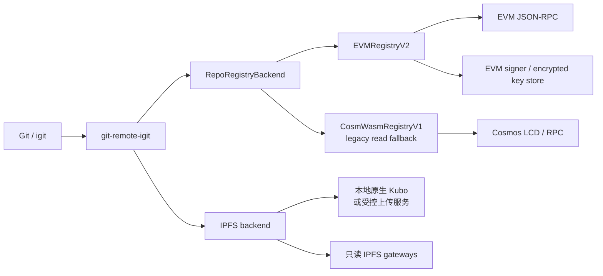

# Next Injective Git 架构

> CLI：`igit` / `git-remote-igit`；当前部署：CosmWasm V1；目标控制面：
> Injective EVM V2。详细阶段门见
> [EVM V2 迁移规范](./evm-v2-migration.md)，实际基础设施见
> [infrastructure.md](./infrastructure.md)。

## 产品边界

iGit 让开发者使用原生 Git 工作流，把 Git 对象存入内容寻址的数据面，并
把仓库、refs 和权限记录在 Injective 控制面。完成迁移后的用户协议是
`igit://<inj1-address-or-username>/<repo>`，不需要选择 EVM 或 CosmWasm。当前
显式 `evm/v2` profile 只支持 `inj1...`/`0x...` owner；`auto + v2` 才能通过
V1 LCD 解析已有 username，直到 V2 username registry 或独立 resolver 上线。

- **Git 层**：Git 生成/验证 packfile，remote helper 实现 Git remote helper
  协议；
- **IPFS 层**：独立 backend 临时上传和持久化 packfile，以 CID 保证内容
  完整性；
- **Chain API**：统一仓库/ref 查询和交易接口；目标态默认写 EVM V2，迁移期
  兼容读取 V1；当前发布 profile 仍是 `auto/v1`，直接选择 V1；
- **Signer**：EVM 原生 signer 是目标默认，Cosmos/`injectived` 只保留 legacy
  兼容；
- **Web**：与 CLI 共用合约 ABI、网络 profile 和仓库状态语义。

## 目标数据流



当前发布的 `auto/v1` profile 直接选择 V1。下面是切换到 `auto + v2` 后的
目标兼容规则，查询和写入不是对称的：

1. 查询 V2；只有 EVM 返回解码后的 typed `LocatorNotFound(address,string)` 时才查询 V1；
2. 新仓库只创建在 V2；
3. 已迁移仓库只写 V2；
4. 迁移窗口内的旧仓库可以使用明确的 legacy 路径；
5. 同一仓库不得成功写入两个合约。

在 `auto + v2` 模式下，只有 typed `LocatorNotFound(address,string)` 才能建立
V1 read adapter。解析结果会设置 `WriteDisabled`，因此 Clone/Fetch 仍可读取，
但 remote helper 会在 preflight、pack、Kubo、签名和广播之前拒绝 Push/Delete，
不会产生数据面或链上副作用。显式选择 `evm`/`v2` 时不建立 LCD fallback；V2 的
RPC、解码、权限和 `RepoMoved` 错误会原样返回。

## Git Push

```text
git push <remote> <ref>
  1. remote helper 通过统一 Chain API 查询远端 refs
  2. git pack-objects 生成增量 pack
  3. IPFS backend 临时上传并取得 ipfs://CID
  4. 受控持久化端确认 Pin 和 pack SHA-256
  5. registry backend 执行 updateRef/update_ref
  6. transfer backend 等待 receipt/链上确认并解码错误
  7. 成功后回报 Git；失败时保留可重试的临时数据
```

`expectedSha` 提供乐观并发保护。普通 push 必须匹配远端 tip；force push
必须显式传递 force，并生成能独立重建目标历史的 pack。合约不遍历 Git DAG，
fast-forward 检查仍由 Git/remote helper 完成。

## Clone 和 Fetch

```text
git clone igit://<owner>/<repo>
  1. 当前 auto/v1 直接读取 V1；切换后的 auto + v2 按 V2 -> V1 读取
     repo/listRefs/resolveRef
  2. IPFS backend 从健康的项目网关读取全部 pack URI
  3. git index-pack --stdin --fix-thin 验证并写入对象库
  4. Git 完成 checkout
```

Clone/Fetch 不依赖本地 Kubo，也不需要 signer。V1 fallback 只改变 ref 的
查询来源，不改变 pack 下载和 Git 完整性校验。

## CLI 模块边界

| 模块 | 职责 |
|---|---|
| `cmd/git-remote-igit` | remote helper 入口和 URL 解析，不包含链特定逻辑 |
| `cmd/igit` | 用户命令、setup、doctor 和兼容命令 |
| `internal/remote` | remote helper 协议状态机和 Git 操作顺序 |
| `internal/gitio` | `pack-objects` / `index-pack` |
| `internal/ipfs` | 临时 add、受控复制和只读 gateway fallback |
| `internal/chain` | `RepoRegistryBackend`、V1/V2 adapter、signer 和 transfer |
| `internal/config` | network profile 和向后兼容配置，不保存私钥 |

remote helper 只能依赖抽象接口。CosmWasm 消息、EVM calldata、地址转换、nonce
和 receipt 必须封装在各自 backend 中。Kubo 独立于 signer；V2 setup 已使用
Kubo-only installer，在 Windows/Linux 上都不会检查或安装 `injectived`。

EVM keystore 密码从 controlling terminal 读取：POSIX 使用 `/dev/tty`，原生
Windows 使用 `CONIN$`/`CONOUT$`；Git remote-helper 的 stdin/stdout 始终只承载
Git 协议。`IGIT_EVM_KEY_PASSWORD` 仅用于明确的非交互自动化。选择命名 network
profile 时，配置层以一次原子替换同时更新 Cosmos/EVM chain ID、LCD/RPC、explorer
和 V1/V2 contract 字段，不保留旧网络的半套 endpoint。

## 合约版本

### CosmWasm V1

`contracts/repo-registry` 是当前 testnet 的完整功能实现，支持 refs、协作者、
所有权、moderation、guardian、sponsor、split、username、fork、badge、release
和 upgrade timelock。迁移期冻结非必要功能，只保留安全修复和行为对照测试。

### EVM V2

`contracts/evm-v2` 先实现 `createRepo`、`updateRef`、`deleteRef`、`getRepo`、
`listRefs` 和 `resolveRef`，并已完成首个协作增量：`setCollaborator`、
`getCollaborator`、`listCollaborators`、maintainer/reader/none 角色和 frozen
拒写规则。协作者更新有独立事件；统一 Go V1/V2 backend 已接入
`igit collab add/remove/list`，并覆盖 ABI 编解码、权限/角色、错误和禁止写回退
测试。repo metadata 增量也已贯通 `updateRepoInfo`、`RepoInfoUpdated`、统一 Go
backend、`igit repo edit` 和 Web EIP-1193 链访问层；CLI/Web metadata 写失败都
直接报错，V2 错误不能转写 CosmWasm，也不能双写。

stable identity 增量已经进入 Solidity 和 checked-in ABI。`createRepo` 使用 domain、
chain ID、registry address、initial owner 和 name 生成创建后不变的 `repoId`；refs、
collaborators 和 metadata 继续以该 ID 归属。`resolveRepo` 同时解析 current locator
和 historical alias，旧 locator 可读但所有写 wrapper 返回带 canonical owner/name
的 `RepoMoved`。统一 Go backend、remote helper 和 Web route 已接入该解析结果：
Push 在 pack/IPFS/sign 前拒绝 moved remote，Web 旧路由显示 canonical 链接，只有
明确的 locator-not-found 查询才允许回退 V1。

V2 owner 仓库列表使用 `listReposPage(owner,cursor,limit)` 返回稳定 `repoId` 与当前
metadata；创建和 ownership accept 都以 O(1) owner 索引更新维护该列表。ref 和
collaborator 列表查询先解析一次 locator，再通过稳定 `repoId` 调用
`listRefsPageById` / `listCollaboratorsPageById`。三类分页每页最多 64 项，客户端
在开始 drain 时取得一个固定的 EVM block tag，并让解析和所有页面都读取该快照；
必须检查 `nextCursor` 严格前进并排空所有页；一旦选择或成功解析 V2，后续分页
RPC、ABI 或 cursor 错误都直接返回，不能改查 V1。locator 兼容查询 wrapper 仅用于
迁移读取，新的客户端 ref/collaborator 分页路径以 ID-native API 为准。

ownership transfer 合约状态机也已实现：目标 locator 在发起时 reservation，保留
V1 的 7 天 timelock，并提供 30 天 acceptance window、owner cancel、target reject、
permissionless expire 和 O(1) accept。accept 只更新 owner/locator/pending state，
不复制 refs、collaborators 或 metadata；旧 locator 成为同一 `repoId` 的 alias。
同一 `repoId` 可以回到已经存在的历史 alias，但该 alias 不能被其他 repo 复用。
CLI ownership-transfer 已通过统一 backend 接入 begin/accept/cancel/reject/expire/show；
Web transfer 也已接入相同 stable repoId、pending state 和 receipt-checked EVM 交易。
bounded fork、guardian、economic、moderation、badge、release 和扩展 V1 状态迁移
仍未完成。有界批处理决策见
[仓库身份 ADR](./evm-v2-repo-identity.md)，之后再按经济、社区、安全/治理顺序迁移
功能。Solidity 入口、事件、错误和边界限制共同组成协议，不能只用函数名判断 parity。

`cli/cmd/igit-migrate-v1` 已实现 hash-bound、deterministic 的离线 import-plan
generator，plan 输出固定为 `executable:false`。可选 transaction manifest 会生成经过
checked-in ABI 反解测试的 unsigned calldata，但不会访问 RPC、签名或广播。部署级
`RepoRegistryV2ImportController` 可持有 registry admin 并绑定 rolling commitment，
但只有显式 `--controller-contract` 的迁移 profile 才使用它；controller 的 session、
finalize、abort 事件由 controller 发出，repo/ref/collaborator 批次事件仍由 registry
发出。`--verify-state` 已能在离线环境把严格 JSON 状态文件绑定到 plan/snapshot hash、
chain、registry/controller 和一个固定数值 EVM `block_tag`，并精确比较 repo metadata、
refs、pack URI 与 collaborator；比对失败时不会写 plan 或 manifest。只读
`cli/cmd/igit-migrate-v2-state` 已能校验 mined finalize receipt/event/target，以 receipt
block 固定 `importProgress` 和全部分页查询，并在分页前后用 block hash 检测 reorg；精确比对
成功后才会发布不可覆盖的状态文件。`cli/cmd/igit-migrate-v2-run` 则要求精确 plan hash，重新
验证 canonical manifest，使用加密 EVM admin signer，并在广播前持久化 signed raw transaction，
按 `prepared -> broadcast -> mined/reverted` 的不可覆盖文件恢复相同 nonce/raw；成功
receipt/event 通过后才进入下一 sequence，重开时重新向 RPC 核验每个 terminal receipt。
`reverted` 是终态失败证据，不计入成功进度，也不会在恢复时重新广播。存在 deferred sections 时
还必须显式确认这是 core-only import，不能把 core finalize 当成全量 V1 parity。审核后的部署、runner/journal
安全审查和真实链上导入后比对仍未完成。离线 verifier、runner 与 RPC exporter
的存在不等于已经完成真实导入后比对，也不能从 calldata manifest 或
ordered session API 的存在推断迁移已经执行。registry 没有逐项 rollback；controller 的
`abortImport` 仅能在未发布 active session 中切到一份相同 runtime code hash、正确
controller admin、无活动 session 且导入窗口未关闭的新 registry，并不能撤销旧 deployment
状态。`importProgress` 提供固定字段 sequence/count 供断点续传。导入只能发生在没有原生
repo 的新部署，创建第一个原生 repo 或 finalize 后窗口永久关闭。因此部署在 finalize 和
导入后比对完成前不得公开；无法续传的预发布 session 必须按受审计 recovery runbook 使用
新的空白 deployment，不能把半导入状态作为正式 V2 发布。

Mined failures are represented separately as immutable `reverted` records;
they never count as `mined` progress and make the journal terminal. The runner
checks the receipt block against `eth_getBlockByNumber` when recording it and
again for completed successes on resume. This canonical-block check is not an
implicit Ethereum-style confirmation-depth rule. The reviewed Injective
network profile and migration runbook must state the CometBFT finality/RPC
consistency assumption before a real run.

导入协议把 V1 moderation status 固定编码并存储为 `0=active`、`1=frozen`、
`2=delisted`。只有 frozen 拒绝 ref 写入；delisted 仍允许 ref/metadata 更新，但从
默认仓库列表隐藏，与 V1 行为一致。status 同时由 hash-bound manifest/payload 和
import event 固定，供导入后比对。

### Repo metadata patch

V2 固定使用以下 ABI，以显式 bool 区分“未提供”和“提供了空字符串”：

```text
updateRepoInfo(repo, updateDescription, description, updateDefaultBranch, defaultBranch)
```

- CLI 的 `nil` 和 Web 的 `undefined` 编码为 flag `false`，对应字段保持原值；
  `""` 配合 flag `true` 是真实清空，不能被客户端转换成“未提供”；
- 两个 flag 都为 `false` 是允许的 no-op：description/default branch 不变，
  `updatedAt` 仍推进并发出事件；未选中参数中的值完全忽略；
- `RepoInfoUpdated.fieldMask` 的 bit 0 表示 description、bit 1 表示 default
  branch，因此 mask 为 `0/1/2/3`；事件携带更新完成后的两个最终值；
- metadata 只允许 owner 修改，maintainer/reader 无权修改；Frozen 只冻结 ref
  更新和删除，owner 仍可修正 metadata，操作不会自动解冻仓库；
- 只有 flag 为 `true` 的字段参与长度检查：description 最多 1024 bytes，default
  branch 最多 64 bytes；任一选中字段超限时整笔交易原子回滚。

V1 核心 repo/ref/collaborator 的 ordered import session API 已在 Solidity 源码和 ABI
中实现；该 API 本身不等于 runner，广播和 journal 由独立的 `igit-migrate-v2-run` 运维边界
承担。该 API 会 grandfather 已存在的历史
metadata：按快照原值导入，不截断、不替换默认值；即使某个历史字段超过 V2 的交互式
上限，也不能阻塞 owner 更新另一个未超限字段。之后若显式选择更新该历史字段，
新值必须满足 V2 长度限制。

这些能力目前仍是 V2-alpha 源码状态。Solidity 源码、测试合约和 checked-in ABI
已通过 `node scripts/evm-v2-solc-check.mjs` 的 `solc@0.8.24` 编译/一致性检查。
仓库没有审核后的 V2 testnet 部署地址，当前 Windows 环境也没有 `forge`，因此
Foundry runtime/fuzz/invariant/gas 尚未实跑。原生 Kubo 的 manifest/解压/setup
边界和隔离 Windows daemon smoke 已有自动测试，但无 WSL2 的 clean-machine
Windows/Linux Push E2E 仍未验收。它们不能被描述为已发布的 V2-beta 能力。

## 地址、密钥和网络

- 用户界面和 `igit://` URL 继续使用 `inj1...`；EVM backend 内部转换为 20
  字节地址；
- network profile 提供 RPC、chain ID、合约和 explorer，普通用户不编辑；
- 当前 Windows/Linux EVM signer 都使用 scrypt 加密的 geth keystore；
  Credential Manager、系统 keyring 和硬件钱包是后续可替换实现；
- `igit key show` 只显示地址，任何命令都不能把助记词/私钥写入日志或
  `config.json`；
- WSL2 和 `injectived` 只属于 V1 legacy signer，不是 V2 的安装前提。

## 安全和可用性边界

- CID 和 Git 对象哈希保证内容完整性；链上不验证完整 Git DAG；
- 恶意 maintainer 可以引用缺少对象的 CID，客户端必须以 `index-pack` 失败，
  不能接受损坏对象；
- Pin 确认先于 ref 交易，交易确认先于本地临时数据回收；
- RPC retry 必须保持 nonce 和交易幂等，不能因超时重复执行不同交易；
- V1 fallback 只在 EVM 返回 typed `LocatorNotFound(address,string)` 时触发；
  `RepoNotFound(bytes32)`、`RepoMoved`、`RefNotFound`、网络错误、解码错误或权限
  错误不得被误判为 V1 仓库；
- 数据迁移以带区块高度和快照哈希的规范化导出为准，禁止永久双写。

`migration-readiness.sh` / `.ps1` 只验证源码和本机可用工具链，并输出
`MIGRATION SOURCE READINESS`；它们不检查真实部署或迁移证据。正式切换还必须
通过独立的 `migration-cutover-readiness` 哈希证据门。该门禁只校验所需证据的
存在性、安全路径、精确 SHA-256 绑定和 approval 元数据；部署、测试、journal、
E2E、runbook 与安全审查内容仍必须由 reviewer 做语义验证。当前 tag release
workflow 只运行该门禁的 fail-closed 回归 fixture，并在独立 cutover 发布路径完成前
强制 V1-only profile；不能用 source gate 或 fixture 的 PASS 替代真实证据。
