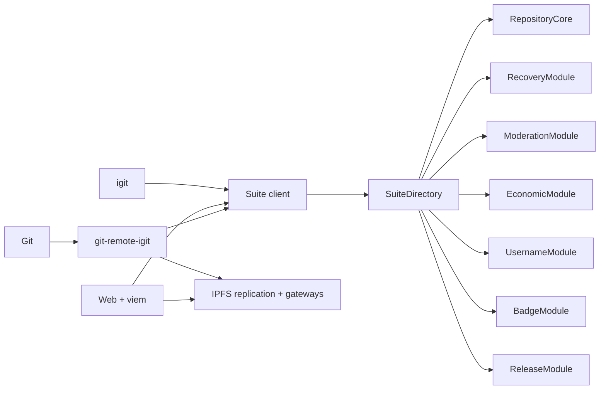

# Immutable EVM Suite Architecture

The public product path is EVM-only. A network profile contains endpoints,
chain ID, and one `SuiteDirectory` address. CLI, Web, and `git-remote-igit`
resolve all other contracts from that Directory and fail closed unless it is
version 3, active, code-hash verified, and internally bound.

`RepositoryCore` owns stable repo IDs, canonical and historical locators,
metadata, refs, collaborators, transfer, and fork lineage. `RecoveryModule`
owns guardian proposals and is the only recovery capability accepted by Core.
`ModerationModule` owns reports, appeals, trails, and mandatory policy hooks.
`EconomicModule` accepts new sponsorship only in native INJ while retaining
queryable migrated totals by historical denomination. The remaining modules
own usernames, non-transferable badges, and immutable release hashes.

No Suite contract is upgradeable. There are no proxies, diamonds, or
`delegatecall`. Directory configuration is one-shot and activation freezes it.

## Transactions

Go writes pass through one `EVMTransactor`: chain validation, pending nonce,
gas estimate, legacy type-0 signing, minimum `160000000 wei` gas price,
broadcast, and bounded two-minute receipt polling. A broadcast whose final
receipt is unknown returns a typed error containing the transaction hash and
invalidates local nonce state. Web uses viem with the same explicit gas/type
rules and checks receipt success.

## Bootstrap

`BootstrapCoordinator` binds the complete snapshot root and imports Core,
Recovery, Moderation, Economic, Username, Badge, and Release in fixed order.
Each batch has bounded count and bytes, sequence, payload hash, and rolling
commitment. Each module finalizes once after expected count/root verification.
Only then can the coordinator atomically activate the Directory.

## V1 Boundary

Historical chain access exists only under `archive/cosmwasm-v1` and the
read-only `igit archive` command. Ordinary clients have no archive fallback or
write path. Snapshot evidence is fixed-height, block-hash bound, inventory
complete, and verified before it can become a Suite bootstrap plan.

See [migration](evm-v2-migration.md) and [release](release.md).
