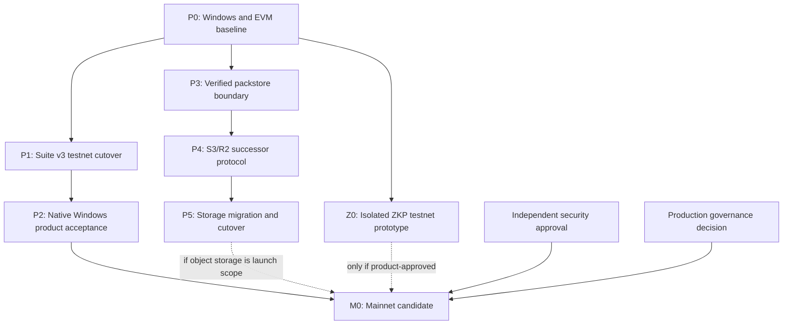

# Delivery Roadmap

- Status: Active execution plan
- Initial assessment: 2026-08-15
- Assessment baseline: `012a916a8437b6765a7fd08f97d7975ab661a430`
- Current public availability: None; checked-in Suite profiles remain intentionally empty

> [!IMPORTANT]
> This document tracks sequencing, dependencies, delivery status, and exit
> criteria. It is not deployment evidence. A milestone is not complete until
> its commit-bound evidence passes the gates in
> [Release And Cutover](release.md) and
> [Acceptance Evidence](acceptance-evidence.md).

## Purpose And Document Boundaries

This is the execution hub for the next product phases: a usable Injective EVM
control plane, native Windows operation without WSL2, pluggable Amazon S3 and
Cloudflare R2 pack storage, and an isolated Injective testnet ZKP prototype.

The surrounding documents retain their narrower authority:

| Document | Authority |
|---|---|
| [ADR 0001](adr/0001-evm-v2-runtime-and-migration-scope.md) | Accepted EVM V2 runtime, immutable Suite, migration, and platform decisions |
| [ADR 0002](adr/0002-pluggable-pack-storage.md) | Accepted direction and required properties for pluggable pack storage |
| [Architecture](architecture.md) | Current immutable Suite and data-plane boundaries |
| [EVM V2 Migration](evm-v2-migration.md) | Migration workflow, present implementation, and completion definition |
| [Remaining Work](backlog.md) | Granular engineering and policy task inventory |
| [Open Decisions](open-questions.md) | Decisions that require explicit review rather than implementation inference |
| [Release And Cutover](release.md) | Release contents and the cutover gate |
| [Acceptance Evidence](acceptance-evidence.md) | Required real evidence and its binding rules |
| [P0 Evidence Record](p0-evidence.md) | Commit-bound Windows/Linux CI and local P0 verification snapshot |
| [Infrastructure](infrastructure.md) | As-built IPFS data plane; not EVM or object-storage acceptance |

When this roadmap conflicts with an accepted ADR, the ADR wins. When it
conflicts with real cutover evidence, the evidence wins and this roadmap must
be corrected.

## Current Delivery Truth

The status below describes the repository at the assessment baseline. Source
presence, CI configuration, fixtures, and local probes do not establish public
availability.

| Area | Current status | Blocking fact |
|---|---|---|
| Immutable EVM Suite source | Implemented in source; evidence pending | No commit-bound reviewed CI and security approval for this delivery state |
| Testnet Suite deployment | Blocked | Public `SuiteDirectory` profiles are empty; no reviewed deployment, import, activation, or cutover evidence exists |
| Migration operator | Blocked | Current tooling builds and verifies unsigned calldata but does not broadcast, journal, resume, or activate |
| Native Windows ordinary use | Partially implemented; acceptance blocked | Unit/build coverage exists, but clean Git E2E and a fully green native Windows gate do not |
| Current IPFS pack storage | Implemented current data path | Native Kubo is still required for push; clone/fetch use gateways |
| Amazon S3 / Cloudflare R2 | Direction accepted; not implemented | Current Suite, CLI, and Web accept only `ipfs://` |
| ZKP on Injective testnet | Research only | No circuit, proving pipeline, verifier, deployment, or product authorization integration exists |
| Mainnet | Not scheduled for release | Governance, storage scope, security, migration, and acceptance decisions remain open |

Observed native Windows blockers at the initial assessment include:

- `core.autocrlf=true` checks out Suite Solidity and artifact JSON with CRLF,
  while checked artifacts bind LF source bytes. The Solidity artifact and
  deployment checks therefore fail.
- Some tests assert English error text and fail under a Chinese Windows locale
  even when behavior is correct.
- Migration evidence tests assert POSIX `0600`, which is not a Windows DACL
  guarantee.
- The configured mainnet EVM endpoint uses the retired
  `k8s.json-rpc.injective.network` hostname rather than the current official
  endpoint.
- The native Kubo smoke can spend its full download budget on one slow source
  without reaching a fallback mirror.

These findings must be reproduced in CI before being closed. They are not a
substitute for a retained CI run.

The retained CI and local verification ledger is [P0 Evidence
Record](p0-evidence.md). It currently records historical green runs and the
local host limitations; the newly added clean-clone gate remains open until its
post-push run is bound to an exact commit.

## Non-Negotiable Guardrails

- Do not publish a `SuiteDirectory` until the exact reviewed commit passes the
  full evidence gate.
- Do not add a V1 runtime fallback, mixed control-plane backend, double write,
  proxy, diamond, `delegatecall`, or direct module trust root.
- Do not claim S3 or R2 support from an endpoint, credential, operations
  script, emulator, or roadmap entry alone.
- Do not place cloud credentials, bucket secrets, bearer tokens, presigned
  URLs, or private endpoints on-chain, in Git remotes, or in logs.
- Verify pack size and a stable content digest before Git consumes downloaded
  bytes. An ETag is not a portable content digest.
- Do not use ZKP to replace ordinary content hashing. Storage integrity remains
  a direct SHA-256 verification problem.
- Do not integrate a ZKP verifier into the immutable Suite until the product
  statement, public inputs, replay model, setup, and audit requirements have
  been accepted in a successor design.
- Do not treat CI definitions, fixtures, local probes, or old deployments as
  real acceptance evidence.

## Dependency Map



P1 may use the current IPFS data path on testnet. If object storage is a mainnet
launch requirement, mainnet should target the storage-neutral successor rather
than deploy Suite v3 and immediately require another mainnet migration.

## Milestone Summary

Estimates are engineering ranges, not release commitments. They exclude
external security-review scheduling, funding, governance approval, and third-
party service delays.

| ID | Milestone | Initial status | Estimate | Primary exit condition |
|---|---|---|---:|---|
| P0 | Windows and EVM baseline repair | Next | 2-4 days | Native Windows source gates and commit-bound CI are green |
| P1 | Suite v3 testnet deployment and cutover | Blocked by P0 and operator work | 1-2 weeks | Active verified Directory plus complete real cutover evidence |
| P2 | Native Windows product acceptance | Blocked by P1 | 3-5 days | Clean Windows release-asset Git E2E without WSL2 or `injectived` |
| P3 | Verified packstore boundary and streaming | Planned after P0 | 4-7 days | IPFS behavior preserved behind the new boundary; all downloads verify digest and size |
| P4 | S3/R2 successor protocol and adapters | Blocked by design gate | 2-3 weeks | Successor Suite and real AWS/R2 provider workflows pass |
| P5 | Historical storage migration and cutover | Blocked by P4 | 1 week | Hash-bound CID mapping, dual-read rollback window, and provider E2E pass |
| Z0 | Isolated ZKP testnet prototype | Can run after P0 | 3-5 days | Useful proof statement verified on testnet with reproducible benchmarks |
| M0 | Mainnet candidate | Not scheduled | TBD | P1/P2, conditional P5, governance, finality, and independent approval are complete |

## P0: Windows And EVM Baseline Repair

### Deliverables

1. Pin LF for Suite Solidity, ABI JSON, and checked artifact JSON in
   `.gitattributes`. Exercise the artifact gate after a Windows checkout with
   `core.autocrlf=true`.
2. Replace locale-sensitive string assertions with stable error types or codes.
   Test both English and Chinese rendering separately from behavior.
3. Define sensitive-file behavior per platform. POSIX continues to require
   restrictive modes; Windows must apply and test a current-user/SYSTEM DACL
   where secrets are persisted.
4. Replace the stale mainnet RPC default with the current official endpoint
   `https://sentry.evm-rpc.injective.network/` and retain EVM chain ID `1776`.
   Keep testnet on `https://k8s.testnet.json-rpc.injective.network/` with EVM
   chain ID `1439`; do not confuse either value with the Cosmos chain ID.
5. Give every Kubo download source bounded connect, header, idle, and total
   timeouts; add Windows-accessible project mirrors before the public origin.
6. Reconcile transaction documentation with current chain behavior. The
   current [Injective EVM FAQ](https://docs.injective.network/developers-evm/evm-integrations-faq)
   explicitly supports EIP-1559, and both published chain configurations enable
   London from block zero. At the assessment date, read-only testnet calls
   exposed London fee data and accepted type-2 fields for gas estimation. Keep
   the tested legacy type-0 path until a funded, signed type-2 canary is
   broadcast and its receipt is retained.
7. Open a reviewable PR for the EVM branch and retain the exact green CI URL and
   commit. Workflow source alone is not evidence.

### Exit Criteria

- `go vet ./...` and `go test -count=1 ./...` pass on native Windows and Linux.
- `npm run check` passes from `contracts/evm-v2` on both checkout styles.
- `igit-deploy-suite --check` accepts the exact checked source and artifacts on
  Windows and Linux.
- The PowerShell cutover fixture passes without relying on Bash or WSL2.
- The native Kubo lifecycle reaches a bounded fallback, starts, probes, and
  shuts down without leaving a process or temporary repository.
- The retained CI run is bound to the reviewed commit.

## P1: Suite V3 Testnet Deployment And Cutover

### Deliverables

1. Implement the reviewed operator runner for the deterministic calldata
   manifest. It must use the encrypted EVM keystore, preserve an append-only
   signed journal and receipts, resume safely after uncertain receipts, and
   emit fixed-block imported-state evidence.
2. Rotate and fund the testnet operator key. Fix the V1 cutover height and
   produce the complete inventory, snapshot, sidecar hash, and username escrow
   release evidence.
3. Deploy all nine contracts with no-clobber evidence and verify each contract
   on Blockscout.
4. Import every bounded batch in the required order, verify counts and rolling
   commitments, then atomically activate the Directory.
5. Compare every migrated domain at one finalized block and record the final
   Directory state, code hashes, and module bindings.
6. Execute MetaMask writes and clean Linux/Windows Git E2E, including historical
   alias resolution and uncertain-receipt handling.
7. Resolve deep source and runner security findings and obtain the independent
   hash-bound cutover approval.

### Exit Criteria

The exact evidence directory passes
`scripts/migration-cutover-readiness.sh`; only then may the testnet
`SuiteDirectory` be added to CLI and Web profiles. See
[EVM V2 Migration](evm-v2-migration.md) for the ordered workflow and
[Release And Cutover](release.md) for the gate.

## P2: Native Windows Product Acceptance

Native Windows has three distinct scopes:

| Scope | Requirement |
|---|---|
| Ordinary user | Must install and use release assets without WSL2 or `injectived` |
| Contributor | Must run Go, Web, portable Solidity, and PowerShell source gates natively; Foundry parity remains commit-bound CI evidence |
| Infrastructure operator | Linux server operations may remain Linux-specific, but ordinary client setup must never invoke them implicitly |

### Deliverables And Exit Criteria

- Publish checksum-verified Windows `igit.exe` and `git-remote-igit.exe` assets
  with a native installer that selects, renames, installs, and updates PATH.
- Rename any WSL bootstrap as an explicit legacy operator path; it must not be
  presented as normal EVM V2 setup.
- Add managed native Kubo `start`, `stop`, `status`, and on-demand restart for
  the current IPFS profile.
- From a clean Windows VM and release artifacts only, complete `init`, `push`,
  `clone`, `fetch`, `pull`, incremental push, force push, ref deletion, and
  historical alias resolution.
- Record that WSL2 and `injectived` are absent. An accepted future S3/R2 profile
  must additionally record that Kubo is absent.

## P3: Verified Packstore Boundary And Streaming

This phase changes client structure while preserving the current IPFS protocol.

### Proposed Client Boundary

```text
Writer.PutIfAbsent(ctx, source{path, size, sha256}) -> receipt
Writer.VerifyDurable(ctx, receipt) -> error
Reader.Open(ctx, packRef) -> stream
```

### Deliverables

- Introduce `cli/internal/packstore`; adapt IPFS through it before adding a new
  provider.
- Replace provider-specific `needsKubo` branching with profile capabilities and
  provider-specific doctor checks.
- Generate packs into native temporary files and compute size/SHA-256 while
  streaming. Do not retain unbounded packs in memory.
- Download to a temporary file, verify exact size and SHA-256, close and reopen
  it on Windows, and only then run `git index-pack`.
- Preserve the existing durability saga: durable data first, chain ref second,
  local cleanup last. A failed chain transaction retains a retryable object.
- Preserve thin-pack ordering. Migration copies original pack bytes and order;
  it must not silently repack history.
- Add explicit browser pack-size limits and Web Crypto digest verification
  before the Web application ingests bytes.

### Exit Criteria

All existing IPFS tests and clean Git E2E remain unchanged from the user's
perspective, while corrupted, truncated, extended, or substituted content is
rejected before Git consumption.

## P4: S3/R2 Successor Protocol And Adapters

ADR 0002 accepts the direction but does not yet freeze the successor ABI. The
following is the working proposal and must be approved in a detailed successor
protocol ADR before contract implementation:

```text
PackRef {
  kind: LegacyIPFS | ContentSHA256
  logicalProfileId: bytes32
  sha256: bytes32
  size: uint64
}

object key = packs/v1/sha256/<first-two-hex>/<64-lowercase-hex>.pack
```

`logicalProfileId` names a resolvable storage domain, not AWS or R2. The same
digest may be mirrored across providers without rewriting every on-chain ref.
Bucket names, account IDs, credentials, and expiring URLs stay off-chain.

### Product Decision Gate

The first release should use platform-managed logical profiles. Arbitrary
bring-your-own private buckets are blocked until endpoint discovery, signed
profile distribution, authorization, disaster recovery, and private repository
encryption/key distribution are designed. ZKP does not solve those problems.

### Provider Common Denominator

| Capability | Amazon S3 | Cloudflare R2 | Protocol rule |
|---|---|---|---|
| API client | AWS SDK Go v2 | AWS SDK Go v2 with `region=auto` and R2 base endpoint | Keep provider options separate |
| Create-only upload | Conditional `If-None-Match: *` | Conditional `If-None-Match: *` | A duplicate is accepted only after verifying the existing object |
| Upload integrity | `ChecksumSHA256` plus size | `Content-MD5`, application SHA-256 metadata, and managed re-read | Chain-bound SHA-256 is authoritative |
| Read consistency | Strong read-after-write | Strong read-after-write | Still verify bytes end to end |
| Retention | Versioning and Object Lock | Native Bucket Locks | Retention is operational enhancement, not reference syntax |
| Encryption at rest | Provider-managed options | Automatic AES-256; SSE-C optional | Never assume provider headers are portable |

Never use ETag as SHA-256, especially with multipart uploads or encryption.
R2 does not implement all S3 checksum, versioning, Object Lock, ACL, tagging,
or SSE-KMS features, so sending one undifferentiated AWS request shape is not
accepted.

### Managed Upload Flow

1. The client creates a temporary pack and computes exact digest and size.
2. The authorization service binds owner, repository, ref, digest, size, key,
   content type, expiry, and one-time request ID.
3. It returns a short-lived conditional presigned PUT and required headers.
4. The client uploads; the managed service independently verifies durable bytes.
5. Only the verified receipt permits the chain ref update.
6. Presigned URLs are bearer tokens and must never enter logs or persistent
   configuration.

### Exit Criteria

- Unit and provider-contract tests cover new upload, duplicate `412`, retryable
  `409/429/5xx`, authorization expiry, wrong size, wrong digest, truncation,
  extension, content transformation, early close, and orphan handling.
- Protected live workflows exercise real S3 and R2 small/multipart objects,
  CORS, presigned PUT/GET, provider retention configuration, and cleanup.
- Native Windows and Linux complete the full Git workflow for both accepted
  providers with no Kubo process and no secret in config, output, or logs.
- The successor Suite, ABI, CLI, Web, migration schema, and evidence gate agree
  on one canonical reference encoding.

## P5: Historical Storage Migration And Cutover

### Deliverables

- At a fixed finalized view, enumerate every historical pack URI in original
  order and fetch the original bytes.
- Build a hash-bound `CID -> sha256, size, object key, provider receipt`
  manifest. Copy bytes; do not regenerate thin packs.
- Deduplicate by digest and independently read/verify every destination object.
- Import successor references while preserving historical aliases and ref pack
  ordering.
- Retain IPFS reads for a reviewed rollback window. Do not delete current pins
  merely because successor writes have started.
- Implement orphan and unreachable-object GC from finalized chain inventory
  with a long grace period. Bucket locks and lifecycle rules must not delete
  reachable packs.
- Define compaction/self-contained pack policy before the existing per-ref pack
  limit becomes an operational failure.

### Exit Criteria

Mixed legacy/object-reference tests, rollback, finality, native Windows/Linux,
real provider, and mainland-network acceptance all pass. The successor cutover
requires its own evidence set; the Suite v3 IPFS evidence cannot be reused as
proof of S3/R2 support.

## Z0: Isolated ZKP Testnet Prototype

### Recommended First Product Statement

Prove that a contributor belongs to an authorized repository group without
revealing which member they are. Bind the proof to an approved
`membershipRoot`; domain-separate the statement with `chainId`, the
verifier/authorization contract, and a protocol version; then bind it to
`repoId`, an action, the pack digest, an epoch, and `msg.sender` or an explicit
recipient. The public nullifier must be derived from the identity secret and
an action-scoped external nullifier, and the contract must record it as spent.
These bindings prevent cross-chain, cross-contract, cross-action, and mempool
proof replay.

This is a useful authorization experiment. A hash-preimage demo may validate
tooling but is not a product milestone. Claims such as private repository
storage, secret scanning, or reproducible private builds require separate,
substantially larger designs.

### Proposed Toolchain

- Use [gnark v0.15.0](https://github.com/Consensys/gnark/releases/tag/v0.15.0)
  with Groth16 on BN254 for the first native-Windows/Go prototype. It can export
  a Solidity verifier, but generated source remains project code to review and
  test; the generator does not make this circuit or integration audited.
- Pin gnark `v0.15.0`, which declares Go `1.25.7`, in an isolated Go module and
  CI job. Do not implicitly raise the CLI's Go 1.22 baseline.
- Deploy a standalone verifier/authorization experiment on Injective testnet.
  Do not add it to the public Suite trust root.
- Treat the constraint system, proving/verifying keys, circuit source, compiler
  version, verifier source, setup policy, and deployment receipt as hash-bound
  artifacts.

On 2026-08-15, read-only calls against the official Injective testnet RPC
returned chain ID `1439`, London fee data, and expected results from the
standard precompiles used by gnark's BN254 verifier: MODEXP (`0x05`), ECADD
(`0x06`), ECMUL (`0x07`), and pairing (`0x08`). This supports a Groth16
feasibility experiment only; it is not verifier deployment, a valid/invalid
proof transaction test, a gas benchmark, or product acceptance evidence.

### Exit Criteria

- The product statement and public/private inputs are reviewed.
- Native Windows compiles the pinned circuit, generates and locally verifies
  proofs, serializes the exact constraint system and proving/verifying keys,
  and deterministically exports Solidity from the hash-bound verifying key.
  Re-running a randomized Groth16 setup is not expected to reproduce the same
  keys.
- Injective testnet verifies valid proofs and rejects invalid, replayed,
  recipient-swapped, repo-swapped, action-swapped, chain-swapped,
  contract-swapped, protocol-swapped, and stale-epoch proofs.
- Evidence records constraints, setup type, proof/calldata size, Windows prover
  time and peak memory, verifier gas, transaction hash, receipt, contract source,
  and Blockscout verification.
- Production integration remains blocked on circuit and verifier audits,
  trusted-setup policy, root governance, front-running review, privacy leakage
  review, and successor Suite design.

## Mainnet Decision Gate

Mainnet remains unscheduled until all of the following are explicit:

- Decide whether object storage is a launch requirement. If yes, target the
  storage-neutral successor rather than Suite v3.
- Define multisig membership, quorum, timelock, emergency powers, and key
  separation.
- Approve platform fee, treasury, username claim, finality, reorg, evidence
  retention, and independent reviewer policies in
  [Open Decisions](open-questions.md).
- Complete migration, native Windows/Linux, Web, storage, finality, security,
  and governance evidence for the exact release commit.
- Treat ZKP as optional unless a separately approved product requirement makes
  it part of the successor.

## Test And Evidence Matrix

| Layer | Every PR | Protected/manual | Release evidence |
|---|---|---|---|
| Go/CLI | Unit, race, vet, Windows/Linux build | Native Kubo and failure injection | Clean release-asset Git E2E |
| Solidity | Locked solc, ABI/artifact parity, Foundry unit/invariant/gas | Deployment dry run | Nine receipts, source/runtime verification |
| Web | API tests, typecheck, production build | Wallet/RPC error injection | Real MetaMask receipts |
| Migration | Deterministic plan/manifest fixtures | Runner resume and uncertain receipt | Signed journal, receipts, fixed-block parity |
| S3/R2 | Provider contract fixtures on Windows/Linux | Real AWS/R2 small and multipart canaries | No-Kubo full Git E2E and migration evidence |
| ZKP | Circuit tests and verifier vectors | Testnet proof/replay/adversarial cases | Separate audit and approval if productized |

The canonical evidence file set is defined in
[Acceptance Evidence](acceptance-evidence.md), not in this table.

## Risk Register

| Risk | Required control |
|---|---|
| Source readiness is mistaken for availability | Empty public profiles and evidence-gated release checks |
| Immediate second immutable migration | Use v3 for testnet; decide storage scope before mainnet |
| Windows line-ending hash drift | Attribute-pinned LF plus Windows artifact gate |
| Locale-dependent behavior tests | Stable typed errors; translation tests remain separate |
| Windows secret exposure | DACL/credential provider; never rely on POSIX modes alone |
| Large pack memory exhaustion | Temporary-file streaming, size limits, multipart tests |
| Mutable or transformed object bytes | Digest-derived keys, no transform, size/SHA-256 verification |
| Provider API mismatch | Separate AWS/R2 capability profiles and live canaries |
| Thin-pack history corruption | Preserve original bytes and URI order during migration |
| Presigned URL leakage/reuse | Short TTL, exact signed headers, one-time authorization state, redaction |
| Premature garbage collection | Finalized inventory, long grace, rollback window, retention-aware GC |
| Mainland provider reachability | Real network sampling and stable read-gateway/failover strategy |
| ZKP replay or front-running | Chain/contract/protocol/recipient/action/repo binding, spent-nullifier and epoch tests |
| Unreviewed trusted setup or circuit | Hash-bound setup policy and independent circuit/verifier audit |

## Implementation References

These references are design input, not project acceptance evidence.

### Injective And EVM

- [Injective EVM network information](https://docs.injective.network/developers-evm/network-information)
- [Injective EVM integration FAQ](https://docs.injective.network/developers-evm/evm-integrations-faq)
- [Injective EVM equivalence](https://docs.injective.network/developers-evm/evm-equivalence)
- [Injective mainnet EVM parameters](https://sentry.lcd.injective.network/injective/evm/v1/params)
- [Injective testnet EVM parameters](https://testnet.sentry.lcd.injective.network/injective/evm/v1/params)
- [Injective Solidity contracts](https://github.com/InjectiveLabs/solidity-contracts)
- [Injective Foundry fork](https://github.com/InjectiveLabs/foundry) for local
  simulation of Injective-specific precompiles; current releases are not a
  native Windows prerequisite for this standard-BN254 prototype
- [Injective core](https://github.com/InjectiveFoundation/injective-core)
- [Foundry releases](https://github.com/foundry-rs/foundry/releases)

### Object Storage And Git Hosting

- [AWS SDK for Go v2](https://github.com/aws/aws-sdk-go-v2)
- [AWS Go v2 S3 examples](https://github.com/awsdocs/aws-doc-sdk-examples/tree/main/gov2/s3)
- [AWS S3 upload integrity](https://docs.aws.amazon.com/AmazonS3/latest/userguide/checking-object-integrity-upload.html)
- [AWS S3 conditional writes](https://docs.aws.amazon.com/AmazonS3/latest/userguide/conditional-writes.html)
- [Cloudflare R2 S3 compatibility](https://developers.cloudflare.com/r2/api/s3/api/)
- [Cloudflare R2 Go SDK example](https://developers.cloudflare.com/r2/examples/aws/aws-sdk-go/)
- [Cloudflare R2 consistency](https://developers.cloudflare.com/r2/reference/consistency/)
- [Cloudflare R2 presigned URLs](https://developers.cloudflare.com/r2/api/s3/presigned-urls/)
- [Cloudflare R2 documentation source](https://github.com/cloudflare/cloudflare-docs/tree/17961742bb23560149196cabea84d34d12307df7/src/content/docs/r2)
- [Gitea storage abstraction](https://github.com/go-gitea/gitea/blob/5b7b00477a7e6658483be8f6b1cf8325e9adf338/modules/storage/storage.go#L76)
- [restic S3 backend](https://github.com/restic/restic/blob/a80be1478a4c537f8396e0db2b05120aa78f11e0/internal/backend/s3/s3.go#L284)
- [rclone R2 guidance](https://github.com/rclone/rclone/blob/6e0c71bd276bd587403fd00e88ef195aa6996789/docs/content/s3.md#L5439)
- [MinIO Go client](https://github.com/minio/minio-go)
- [Git LFS](https://github.com/git-lfs/git-lfs) for content-OID and transfer-protocol patterns

### ZKP

- [gnark v0.15.0 Solidity generator](https://github.com/Consensys/gnark/blob/v0.15.0/backend/groth16/bn254/solidity.go)
- [gnark v0.15.0 module requirements](https://github.com/Consensys/gnark/blob/v0.15.0/go.mod)
- [gnark Solidity export documentation](https://docs.gnark.consensys.io/HowTo/prove#verify-a-proof-on-ethereum)
- [EIP-196](https://eips.ethereum.org/EIPS/eip-196),
  [EIP-197](https://eips.ethereum.org/EIPS/eip-197), and
  [EIP-198](https://eips.ethereum.org/EIPS/eip-198) for BN254 and MODEXP
  precompile behavior
- [Semaphore](https://github.com/semaphore-protocol/semaphore) for membership/nullifier patterns
- [Circom](https://github.com/iden3/circom) and [snarkjs](https://github.com/iden3/snarkjs) as alternative circuit/proof tooling
- [SP1 contracts](https://github.com/succinctlabs/sp1-contracts) and [RISC Zero Ethereum](https://github.com/risc0/risc0-ethereum) for later zkVM evaluation, not the first prototype

### Agent Skills

Skills can assist implementation and review but never satisfy independent
security or release evidence:

- The repository already contains
  [Injective EVM developer guidance](../.agents/skills/injective-evm-developer/SKILL.md).
  Its EIP-1559 guidance is reconciled with current official documentation and
  retains the tested legacy type-0 application policy pending a funded canary.
- The 2026-08-15 `$find-skills` snapshot found
  [Solidity Security](https://skills.sh/wshobson/agents/solidity-security)
  at 13.3K installs; `npx skills add wshobson/agents@solidity-security` can
  support internal pre-audit review.
- The official AWS
  [Querying AWS S3](https://skills.sh/aws/agent-toolkit-for-aws/querying-aws-s3)
  skill had 2.5K installs. It is useful for deployed S3 inspection, not adapter
  architecture or R2 compatibility proof.
- The leading direct
  [Cloudflare R2](https://skills.sh/jezweb/claude-skills/cloudflare-r2) result
  had 473 installs and is third-party. Use Cloudflare's official compatibility
  documentation as protocol authority.
- The official
  [Noir Idioms](https://skills.sh/noir-lang/noir/noir-idioms) result had only
  46 installs. Reconsider it only if the ZKP decision switches from the
  proposed Go/gnark prototype to Noir.

Install counts are a dated discovery signal and will change. No additional
skill was installed during this assessment.

## Immediate PR Sequence

1. **PR 1 - Native baseline:** LF attributes, locale-independent errors,
   Windows permission abstraction/tests, mainnet RPC, bounded Kubo fallback,
   and a commit-bound Windows/Linux CI run.
2. **PR 2 - Operator runner:** append-only journal, safe resume, receipt and
   fixed-block evidence, with no public profile change.
3. **PR 3 - Testnet evidence:** rotate key, deploy, verify, import, activate,
   run Git/Web/finality/security gates, then publish the testnet Directory.
4. **PR 4 - Windows distribution:** installer, managed Kubo lifecycle, and
   release-asset clean-VM E2E.
5. **PR 5 - Packstore boundary:** streaming packs and verified IPFS reads with
   behavior preserved.
6. **ADR/PR 6 - Successor storage protocol:** freeze canonical PackRef,
   profile discovery, managed/BYO scope, retention, GC, and migration.
7. **PR 7+ - S3/R2 and successor:** provider adapters, managed authorization,
   successor Suite/clients, historical mapping, provider E2E, and cutover.
8. **Parallel Z0 PRs:** isolated gnark circuit, verifier, deployment scripts,
   adversarial tests, and benchmark evidence; no Suite integration.

## Updating This Roadmap

For every material delivery PR:

1. Update the relevant milestone status and link its commit-bound evidence.
2. Keep detailed tasks in [Remaining Work](backlog.md); do not duplicate every
   issue here.
3. Record new architecture decisions in an ADR before presenting them here as
   accepted. Label unapproved designs as proposals.
4. Move unresolved product or policy choices to
   [Open Decisions](open-questions.md).
5. Never mark a deployment, platform, provider, or ZKP milestone complete from
   fixtures or local output alone.
6. Update the assessment date and baseline only after reviewing the complete
   merged state.
