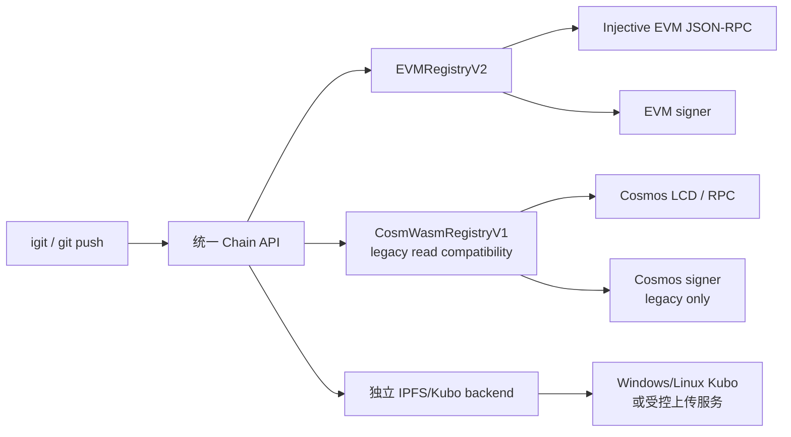

# EVM V2 迁移规范

本文是 iGit 从 CosmWasm V1 迁移到 Injective EVM V2 的执行规范。它定义
产品边界、阶段门、兼容行为和验收命令；它不是当前线上状态的描述。当前已
部署的 CosmWasm 数据面仍以 [infrastructure.md](./infrastructure.md) 和
[target-topology-migration.md](./target-topology-migration.md) 为准。

## 目标和非目标

最终用户只需要理解 `igit init`、`igit push`、`igit clone`、`igit fetch`
以及少量账户维护命令。以下内容必须由 CLI、remote helper 或 Web 自动处理：

- 链上后端、ABI/calldata、Cosmos 消息和 sign mode；
- RPC、chain ID、合约地址、explorer 链接和地址格式转换；
- EVM nonce、gas 估算、receipt 等待、重试和合约级错误解码；
- Windows 密钥存储、Kubo 生命周期和网络 profile 选择。

迁移不采用同一仓库的永久双写。旧仓库可以在迁移窗口内从 V1 读取，所有
新仓库只写入 V2；迁移完成后 V1 合约只读。

## 分层架构



`git-remote-igit` 只依赖 `RepoRegistryBackend`、`SignerBackend`、
`TransferBackend` 和 IPFS backend。它不能导入 `injectived`、Cosmos 消息、
EVM ABI 或 WSL 命令。后端实现负责把链上错误转换成稳定、可读的 CLI 错误。

## 阶段状态

| 阶段 | 交付物 | 通过条件 | 状态 |
|---|---|---|---|
| V2-alpha | Solidity repo/ref 核心、协作者角色、repo metadata、stable repoId/locator alias、ownership transfer、ABI/事件和 Foundry 测试源码 | 本地 EVM 可部署，Git 核心操作、身份/alias、transfer、协作者权限和 metadata patch 通过 | 进行中：Solidity 编译、checked-in ABI 比对和 Go/Web identity 路径已有证据；固定 Foundry v1.7.1 本地完整套件 `78/78`、stateful invariant `128 / 8,192 / 0`、gas ceiling `7/7` 与 gas report 已通过；审核部署、真实 receipt 和 clean-machine E2E 未完成 |
| V2-beta | CLI EVM registry/signer/transfer backend、ownership-transfer 客户端路径、Windows 原生 Kubo 和 key store | Windows 无 WSL2 完成 `init/push/clone/fetch/pull/delete`，旧 locator 可读且写入明确报 moved | 部分完成：backend、keystore、CLI/Web transfer 源码路径、locator preflight、Web moved route、Kubo-only installer 与隔离 daemon smoke 已完成；审核部署、真实 receipt 和 clean-machine E2E 待完成 |
| V2-rc | V1 快照导出、V2 一次性导入、Web/CLI/remote helper 共用 V2 | 数量、owner、refs、CID、权限快照逐项比对 | 部分完成：快照、plan/manifest、ordered import、controller recovery、显式确认的可恢复 runner/receipt journal 和固定块状态 exporter 源码及本地测试已实现；审核部署、runner 安全审查、真实链上导入/比对与 recovery 演练待完成 |
| V2 正式版 | 新仓库默认 V2，V1 只读，文档切换到无 `injectived` 路径 | 清洁 Windows/Linux 验收和安全人工审查完成 | 待实现 |

在 V2-beta 前，`contract_backend=auto` 仍保留 V1 查询兼容；显式请求 V2 但
本地不具备 EVM backend 时必须在发送交易前失败。不能把一个 V1 交易静默
当作 V2 交易。

## V1 冻结和行为基线

冻结 `contracts/repo-registry` 的非必要功能变更，只接受安全修复和严重
Bug 修复。为下列行为保留 CosmWasm V1 对照测试，并将测试 fixture 固定为
迁移输入规范：

- 创建仓库、更新/删除 ref、仓库和 ref 查询；
- owner、maintainer、reader 权限以及所有权转移；
- guardian recovery、moderation、frozen/delisted/active 状态和 appeal；
- sponsor、platform fee、revenue split、username deposit/refund；
- fork、contribution badge、release artifact registry；
- upgrade timelock、proposal hash 和迁移前后的权限边界。

每个 V2 功能都必须包含 Solidity 实现、事件、CLI/Web 调用、查询接口、
权限测试和一组与 V1 结果相同的行为对照测试。Gas、事件参数和错误选择也
应在 review 清单中固定，避免迁移后只验证“交易成功”。

## V2-alpha 核心闭环、协作者、metadata 和 stable identity

Git 核心闭环承诺以下合约入口：

```text
createRepo(name, description, defaultBranch)
updateRepoInfo(repo, updateDescription, description, updateDefaultBranch, defaultBranch)
updateRef(owner, repo, refName, commitSha, packUris, expectedSha, force)
deleteRef(owner, repo, refName)
getRepo(owner, repo)
listRefsPageById(repoId, cursor, limit)
resolveRef(owner, repo, refName)
```

首个协作增量也已进入同一 V2 合约、ABI 和统一 backend：

```text
setCollaborator(owner, repo, collaborator, role)
getCollaborator(owner, repo, collaborator)
listCollaboratorsPageById(repoId, cursor, limit)
setFrozen(owner, repo, frozen)
```

`Role.None` 删除协作者，`Maintainer` 可以更新和删除 ref，`Reader` 只读；只有
owner 可以管理角色。`CollaboratorUpdated` 固定角色变更的事件语义。CLI 的
`igit collab add/remove/list` 通过 `RepoRegistryBackend` 同时适配 V1 和 V2：
locator 查询只有在明确解码为 V2 `LocatorNotFound(address,string)` 时才可回退 V1；
`RepoNotFound(bytes32)`、`RepoMoved`、`RefNotFound` 以及网络/解码/权限错误都不得
触发 fallback。协作者写操作始终只写所选 backend，不能在失败时转写 V1。

repo metadata 已使用同一个合约贯通到 Go 统一 backend/CLI 与 Web EIP-1193
链访问层。固定 ABI 为：

```text
updateRepoInfo(string,bool,string,bool,string)
```

其行为规范为：

1. `updateDescription=false` 时忽略 `description` 参数并保留原值；
   `updateDefaultBranch=false` 时同理。CLI 以 `nil`、Web 以 `undefined` 表示该
   语义。
2. flag 为 `true` 时空字符串是有效的新值，表示真实清空。客户端不得用
   truthiness 判断字段是否提供，也不得把 `""` 改写成 flag `false`。
3. 两个 flag 都为 `false` 是可审计的 no-op：metadata 值不变，`updatedAt`
   仍更新，并发出 `RepoInfoUpdated`。提交与当前值相同的 patch 也推进时间戳。
4. `RepoInfoUpdated.fieldMask` bit 0 表示 description，bit 1 表示 default
   branch；事件的 description/default branch 是交易后的最终存储值，而不是
   未选中参数中的占位值。
5. metadata 是 sender namespace 内的 owner-only 写操作；maintainer、reader
   和其他地址不能修改。Frozen 仓库仍允许 owner 修正 metadata，且更新不会
   改变 frozen 状态；Frozen 对 ref 更新/删除的拒绝保持不变。
6. 只校验 flag 为 `true` 的字段：description 最多 1024 bytes，default branch
   最多 64 bytes。任一选中字段超限时 description、default branch 和
   `updatedAt` 全部原子回滚；未选中的超限占位参数必须被忽略。

Go backend/CLI 将空指针和空字符串分别编码为上述 flag/value 组合；Web 使用
typed EIP-1193、profile 的 chain ID/contract、`eth_sendTransaction` 和有界
receipt 轮询，`status=0x0` 直接报错，成功后清 query cache。CLI 和 Web 的
metadata 写入都只有 V2 单写路径：配置缺失、切链、签名、RPC、receipt 或合约
错误均不得触发 CosmWasm 写 fallback。Repo 页面已经提供 owner-only 编辑入口，
会等待成功 receipt、重新读取 metadata 并显示结果；该 UI 与合约部署和清洁环境
验收一样，仍不构成 V2-beta 或线上可用性声明。

必须具备：

- owner 归属和 `RepoCreated`、`RefUpdated`、`RefDeleted` 事件；
- ref 乐观并发检查、显式 force 规则和 frozen 状态拒写；
- repo/ref/name/URI/commit SHA 长度限制；
- commit SHA 和 IPFS URI 的格式校验，不能只存任意字符串；
- 未授权写入、重复仓库、未知 repo/ref 和冲突 ref 的可断言错误；
- Foundry 单元、边界/fuzz、invariant、gas 报告和本地 EVM 集成测试。

当前协作者、metadata、stable identity/locator alias、ownership transfer、import、
独立 Badge/Economic module 等 Foundry 测试已由固定 v1.7.1 本地执行。完整套件
`78/78` 通过；stateful `RepoRegistryV2Handler` invariant 为 `128 runs / 8,192 calls /
0 reverts`；代表性写入 gas ceiling 套件 `7/7` 通过，`forge test --gas-report` 也
成功完成。Go ABI/backend/CLI 和 Web calldata/receipt/no-fallback 测试覆盖相应客户端
路径。`node scripts/evm-v2-solc-check.mjs` 还使用 `solc@0.8.24`、optimizer 和 `viaIR`
编译 Solidity 源码与测试合约，并通过 checked-in ABI 一致性比对。这些都是本地
源码和测试证据，不是审核后的部署、真实 receipt、clean-machine E2E 或安全审查证据。

当前 registry runtime 为 24,433 bytes，只剩 143 bytes EIP-170 空间；portable
检查要求至少保留 128 bytes。Economic 和 Badge 已按 stable `repoId` 拆为独立
module；后续社区、安全治理、fork 和 release 功能也不得进入该单体，必须遵循同一
受审计模块边界，并为模块权限、事件、升级边界和跨模块不变量建立独立
Foundry/CLI/Web 测试。

首个独立 Economic 垂直切片已经按该边界落地：

- `RepoRegistryV2EconomicModule` 以 stable `repoId` 保存 revenue splits 和 sponsor
  totals，原子分配 native INJ、platform fee、显式 split 与 owner remainder；
- Go `EVMEconomicModule` 接入统一 backend，写入使用同一 signer/gas/receipt 流水线，
  查询固定到一个 EVM block tag；只有 typed V2 miss 可读回退 V1，任何写入都不回退；
- Web API 支持 sponsor 和 owner-only split 更新，等待成功 receipt、解码错误并清缓存；
  Repo Sponsors 页面仅向已连接的当前 EVM owner 显示 split 编辑器；
- Solidity、Go 和 Web 测试覆盖权限、输入边界、原子 payout、reentrancy、exact value、
  receipt 失败、fixed-block 查询以及 no-V1-write-fallback。

该切片仍没有审核部署地址或真实链上 receipt。现有 core importer 仍把
`repo_extensions` 列在 `deferred_sections`，因此历史 V1 sponsor、revenue split、
platform fee 等 Economic 状态尚未导入、比对或迁移，不能把新模块可用源码解释为
经济状态迁移完成。

当前 moderation/report vertical slice 也已在独立模块中落地，但边界必须保持诚实：

- `RepoRegistryV2ModerationModule` 以 stable `repoId` 保存 report、resolution、appeal
  和 append-only audit trail；报告 reason hash 限制为 128 bytes，查询按 64 条分页。
- committee/admin fallback、V1 recorded-owner appeal 规则、状态校验和 transfer 后稳定
  identity 均有 Foundry 覆盖；模块 ABI 已纳入 portable solc 和 Foundry ABI 门禁。
- 模块只读核心 registry 的 repo existence/owner/status，并在自身存储 effective status；
  当前核心没有独立 delist 写入口，模块也不会猜测调用 `setFrozen` 或双写。因此这不是
  `updateRef`/`deleteRef` 已被 moderation 阻止的证据；需要后续审核的核心 bridge、CLI/Web
  receipt API 和历史 V1 moderation report import。

### 已实现源码：stable repoId、locator alias 和 ownership transfer

[EVM V2 仓库身份、所有权转移与 Fork ADR](./evm-v2-repo-identity.md) 中的 stable
identity 和 transfer 决策已经进入 `RepoRegistryV2.sol` 与 checked-in ABI：

```text
resolveRepo(owner, repo)
getRepoById(repoId)
computeRepoId(initialOwner, repo)
pendingOwnershipTransfer(repoId)
beginOwnershipTransfer(repoId, newOwner)
cancelOwnershipTransfer(repoId)
rejectOwnershipTransfer(repoId)
expireOwnershipTransfer(repoId)
acceptOwnership(repoId)
```

- native `repoId` 使用 domain、identity chain ID、registry address、initial owner
  和 repo name 生成；ownership transfer 后不重新派生，也不搬迁 refs、roles 或
  metadata；
- current `(owner,name)` locator 和 historical alias 都解析到同一 `repoId`。
  alias 可用于 repo/ref 读取；经 alias 进入的写 wrapper 返回 `RepoMoved` 以及
  current owner/name，不触发 V1 fallback；
- `beginOwnershipTransfer` 立即 reservation 目标 locator，保留 V1 的 7 天 delay，
  并增加 30 天 acceptance window。owner 可 cancel，target 可 reject，过期后任意
  caller 可 cleanup；只有 target 可在有效窗口 accept；
- accept 为 O(1) locator/owner/pending-state 更新。旧 canonical locator 变成 alias；
  如果 new owner 原先是 collaborator，只移除这一条 collaborator 记录，不扫描
  refs；同一 repoId 可以回到已经存在的历史 alias，但 alias 不能转给其他 repo；
- Go `ResolveRepo`、remote helper 和 Web route 已读取 `repoId`/canonical flag：
  clone/fetch 可继续读取 alias，Push 在 pack/IPFS/sign 前返回 canonical URL，Web
  显示 moved notice 并禁止旧路由 metadata 写入。
- owner 仓库列表通过 `listReposPage(owner,cursor,limit)` 返回 stable `repoId` 与
  metadata；创建和 ownership accept 以 O(1) owner 索引更新维护枚举结果；
- ref 和 collaborator 列表先 resolve 一次，再通过 stable `repoId` 排空
  `listRefsPageById` / `listCollaboratorsPageById` 的有界分页。三类分页每页最多
  64 项；`nextCursor` 不前进时客户端必须失败。一旦选择或成功解析 V2，后续分页
  错误不得回退 V1。

这里的“已实现”严格指 Solidity 源码、checked-in ABI、solc 编译/一致性证据、
本地 Foundry v1.7.1 结果、Go/Web identity 适配，以及 CLI/Web ownership-transfer
对统一 V2 行为的接入，不代表已部署或通过发布验收。Web 路径已具备 pending 查询和 begin/cancel/reject/accept/expire
的 receipt-checked EIP-1193 交易，但合约尚未部署，因此没有 testnet receipt 或
clean-machine E2E 证据。bounded fork
仍是下一项，必须使用 ADR 的 revision snapshot、有界 copy/finalize/cancel/cleanup，
不能加入单笔无界 ref 复制循环。由于 storage/API 已改变，首个部署必须是新的 V2
alpha，不能 reinterpret 任何旧 alpha storage。

Git 闭环的验收顺序固定为：

```text
igit setup
igit key new dev
igit key show
igit doctor
igit init <repo>
igit push
igit clone
igit fetch
igit pull
git push --delete
```

其中 `igit setup` 必须只写受控配置和加密 key store，不能把私钥、助记词或
普通文本 keyring 写入 `config.json`、Git 配置、日志或诊断输出。

## 后端和配置契约

配置文件允许记录选择结果，但普通输出不显示底层名称：

```json
{
  "network": "injective-testnet",
  "contract_backend": "auto",
  "contract_version": "v2"
}
```

network profile 负责提供 EVM RPC、Cosmos LCD（只用于 V1 读取）、V2 合约
地址和 explorer 模板。用户不得被要求手工编辑这些值。当前发布 profile 仍是
`auto/v1`，会直接选择 V1；下列规则属于切换后的 `auto + v2` 兼容 profile，
并且必须记录在测试中：

1. 新仓库创建和更新默认选择 V2；
2. 查询先查 V2；只有 typed `LocatorNotFound(address,string)` 才回退 V1，
   `RepoMoved` 和其他合约/RPC/解码错误都保持为 V2 错误；
3. 明确指定的 V1 只用于迁移/legacy 操作；
4. 同一仓库不允许在两个后端成功写入。

兼容读取产生的 legacy repo 必须带有只读标记：在 `auto + v2` 模式下，只有
typed `LocatorNotFound(address,string)` 才能建立 V1 read adapter，解析结果的
`WriteDisabled` 会让 Push/Delete 在 pack、Kubo、sign 和 broadcast 之前失败。
显式 `evm` 或 `v2` 选择不会建立 LCD fallback；V2 的网络、解码、权限和
`RepoMoved` 错误都不能被改写成 V1 查询或写入。这样同一 repo 不会因为一次
兼容读取而产生双写状态。

用户选择命名 network profile 时，配置层必须一次性替换该 profile 所拥有的
Cosmos/EVM chain ID、LCD/RPC、explorer、legacy contract 和 V2 contract 字段。
切换失败时保留旧配置，成功后不得残留旧网络的 RPC、chain ID 或合约地址。

`inj1...` 是用户界面的规范地址。EVM backend 在内部完成 bech32 与 20
字节地址转换，并验证 chain ID 与地址前缀，不能让用户复制 `0x...` 地址
来完成正常 Git 操作。当前显式 `evm/v2` profile 只能使用 `inj1...`/`0x...`
owner；只有 `auto + v2` 可以通过 V1 LCD 解析旧 username。在 V2 username
registry 或独立 resolver 实现前，显式 V2 的 username URL 必须明确返回
unsupported，不能暗中启用完整 LCD fallback。

## Signer、receipt 和故障语义

EVM signer 至少覆盖：

- `eth_call`、`eth_estimateGas`、`eth_sendRawTransaction`；
- nonce 管理、chain ID 校验、gas 上限和 RPC 超时/重试；
- receipt 等待、status 检查和 revert/custom error 解码；
- 当前 Windows/Linux 实现统一使用 scrypt 加密的 geth keystore；Credential
  Manager、系统 keyring 和硬件钱包属于后续可替换 signer；显式导入旧 Cosmos
  key，不自动复制或覆盖。

`igit doctor` 只报告统一的检查项，例如 signer、chain profile、registry
RPC、read gateway 和 Kubo。WSL2、`injectived` 和 `keyring-backend` 只能出现在
legacy 诊断的详细信息中，不能成为新用户的修复命令。

交互式 keystore 密码必须从 controlling terminal 读取：POSIX 使用 `/dev/tty`，
原生 Windows 使用 `CONIN$`/`CONOUT$`，绝不能从 remote-helper 的 Git stdin/stdout
读取或向其写 prompt。`IGIT_EVM_KEY_PASSWORD` 仅允许非交互自动化显式提供。

## V1 状态迁移

迁移工具必须是可重放、可审计、默认只读的批处理：

1. 通过 LCD 导出全部 repo、refs、owner、collaborator 和 metadata；
2. 导出 moderation、badge、release、username、sponsor、split、guardian
   等扩展状态；
3. 对规范化 JSON 生成快照哈希，并保存导出版本、network、contract 和区块；
4. 在 EVM V2 执行一次性导入，记录每批交易 hash 和输入快照哈希；
5. 自动比较 repo 数量、关键字段、ref commit SHA、CID/URI 和权限；
6. 比对失败时停止后续批次，不回滚已验证的快照，也不进行双写补偿；
7. 切换读取顺序为 V2 优先、V1 fallback；迁移窗口结束后把 V1 标记只读。

当前仓库中的 `igit-migrate-v1` 只读取规范化快照及其 `.sha256` sidecar，生成
确定性的、绑定目标 chain/contract 和每批 payload hash 的离线计划。计划固定为
`executable:false`。`--manifest-output` 会进一步生成绑定 plan SHA-256、snapshot/session、
严格 sequence、payload hash 和 expected event 的 unsigned ABI calldata。默认 manifest
直接指向 registry；迁移 profile 显式传入 `--controller-contract` 时，calldata 会经过
deployment-level `RepoRegistryV2ImportController`，而 repo/ref/collaborator 批次的
预期事件仍由 registry 发出。controller 用 registry 地址、snapshot hash、批次序号、
kind、repo ID 和 payload hash 计算 rolling commitment；只有最终值匹配离线 plan 的
`import_commitment` 时才会转发 `finalizeImport`。Solidity V2 已实现单一 admin
import session、普通读写锁、repo/ref/collaborator 计数检查和显式 `finalizeImport`；Go
测试会用 checked-in ABI 反解每条 manifest 交易。`--verify-state FILE` 可在输出 plan 或
manifest 前，对 `igit.evm-v2.import-state.v2` 状态文件执行 fail-closed 离线比对：它显式标记
`import_scope=repo-ref-collaborator-core` 和全部 deferred sections，并绑定
plan/snapshot SHA-256、target chain、registry、可选 controller 和一个固定的十六进制
`block_tag`，再逐项比较 repo metadata、refs、commit SHA、pack URI 与 collaborator role；
重复 repo、未知字段、尾随 JSON、`latest`/`safe` 等可漂移 block tag 都会失败。枚举顺序可以
不同，但内容必须完全相同。该命令仍不会访问 RPC、签名或广播交易。

状态文件由只读 `igit-migrate-v2-state` 链读取器从一个已 mined 的 `finalizeImport` 交易生成。
它校验 receipt status/target/block hash 和 `ImportFinalized` 或 `ImportPublished` 事件，将
`importProgress` 以及所有 repo/ref/collaborator 分页 `eth_call` 固定到 receipt 的同一个规范
数值 `block_tag`，并在分页前后重新读取 block hash 以检测 reorg。导出内容必须先通过与 plan
相同的精确 verifier，才会以不覆盖已有证据的方式发布。该命令不加载 signer、不签名、不广播，
pending 或 reverted receipt 会失败关闭。

管理员广播由 `igit-migrate-v2-run` 单独承担。它严格读取并重新生成 canonical manifest，要求
操作者输入精确 `--confirm-plan-sha256`，再使用现有加密 EVM keystore signer 按顺序估算 gas、
签名、广播并验证 receipt/event。每笔签名结果在广播前先以 mode 0600 写入不可覆盖的
`prepared` 文件，随后追加 `broadcast` 和终态 `mined` / `reverted` 文件；恢复时复用同一 raw transaction
和 nonce，`already known` 只视为同一 raw 的幂等重播，已完成 receipt 会重新向 RPC 核验。
任何 chain、target、calldata、签名 sender、gas ceiling、receipt、event 或 reorg 不一致都会
停止后续 sequence。journal 中的 signed raw transaction 虽不含私钥，但任何持有者都能广播，
必须作为敏感运维证据归档。审核后的 deployment、runner/journal 安全审查和一次真实链上导入
后比对仍是 release gate；源码、本地 fake-RPC 测试、手写状态文件、fixture 或 manifest 都
不能证明迁移已执行。

A mined `status=0x0` receipt is a first-class terminal journal state. The
runner validates its transaction hash, target, block number, and canonical
block hash, then writes an immutable `NNNNNN.reverted.json` record before
returning the failure. `--status` reports the reverted count, failed order, and
receipt hash. That offline view explicitly treats the signer as unauthenticated
journal metadata and does not claim RPC revalidation or signed tamper-proof
audit provenance. Reopening through the
execution path binds the header to the encrypted keystore signer and stops at
that record without signing or
rebroadcasting another transaction for the consumed nonce; recovery requires
the reviewed fresh-registry/controller procedure and a new plan, not deletion
or editing of journal files.

Each journal JSON file is written with mode `0600`, synced before its final
no-clobber hard link, and the containing directory is synchronized on POSIX.
If the hard link succeeds but that directory sync fails, the runner reports a
typed "published but unsynced" error, keeps the transition immutable, and must
reopen the same journal before retrying; it must never treat the transition as
unpublished or link a replacement. On Windows the Go runtime has no portable
directory `Sync` contract, so the operator must retain the same directory and
rely on the file flush plus NTFS atomic-link behavior; this platform limitation
remains part of the clean-machine acceptance and backup runbook.

The current runner performs a canonical-block check when a receipt is recorded
and repeats receipt-evidence and canonical-block checks for every successful or
reverted terminal receipt on resume. A reverted receipt must still be status
`0x0`; a status change, missing receipt, changed evidence, or reorg stops resume
without signing or broadcasting. This is not a generic probabilistic
confirmation-depth policy. Injective uses CometBFT-style
finality, but a real migration run must still document the selected network
profile's finality assumption and RPC consistency behavior in its operator
runbook. No arbitrary Ethereum confirmation count is silently invented by the
CLI. If the reviewed deployment requires an additional depth or finalized-tag
rule, that policy must be added to the network profile and tested before the
real migration is authorized.

当前 import 合约只写 repo/ref/collaborator core。只要 plan 的 `deferred_sections` 非空，runner
还必须显式收到 `--acknowledge-core-only-import`；该确认表示 moderation report、username、
badge、release 和 repo extension/economic/security 状态仍留在 V1 或等待独立 module 迁移，
绝不表示全量 V1 状态已经迁完。

repo header 的 moderation status 在 manifest calldata、payload hash、合约事件和 Repo
storage 中固定编码为 `0=active`、`1=frozen`、`2=delisted`。只有 status 1 阻止 ref
写入；status 2 仍允许 ref/metadata 更新，但默认仓库列表会隐藏它，与 V1 一致。
导入后比对必须验证原始 status 编码和最终三态值。

registry 本身没有逐项 rollback 入口：`importProgress` 返回下一 sequence 和固定计数，
只能按同一 hash-bound manifest 续传并 finalize。controller 仅提供显式、deployment-level
的 `abortImport(sessionId, replacementRegistry)` recovery：只能由 controller admin
在 active pre-release session 中调用，replacement 必须是全新的、有 code、admin 固定为
该 controller 且没有活动 import session 的 registry deployment。abort 会递增 generation、
清空 controller commitment 并记录 abandoned/replacement registry；它不会回滚旧 registry
状态，也不能在 publish 后替换线上 registry。新的 session 必须从新 registry seed 重新计算
commitment，旧 commitment 不能 publish。这不是普通运维切换，也不是生产 rollback。
导入仅允许在没有原生 repo 的新部署执行；第一个原生 repo 创建或 finalize 后窗口永久关闭。
部署在 finalize 和导入后比对完成前不得公开；无法续传时应按受审计 recovery 流程使用新的
空白 deployment，不能发布半导入状态。

迁移快照必须能在离线环境重新计算 hash。导入器不能根据当前链上查询
“猜测”缺失字段，也不能把 V1 的地址转换失败静默映射为零地址。

V1 历史 metadata 采用 grandfather 规则。一次性 importer 必须按规范化快照
逐字节保留 description/default branch，不因其超过 V2 新写入上限而截断、丢弃
仓库或静默替换默认值。grandfather 只属于受快照哈希约束的一次性导入能力，
不能暴露为普通写接口。导入后，`updateRepoInfo` 仍只校验本次 flag 选中的字段：
未选中的历史超限字段可以保留，也不能阻止另一个字段更新；一旦显式更新该字段，
新值必须符合 1024/64 bytes 上限。导入比对必须同时覆盖原始 metadata bytes。

## Web、IPFS 和发布切换

Web 使用 EVM wallet、ABI、`eth_call` 和 receipt；metadata 链访问层已经按
profile 自动切换 EVM chain，发送 V2 transaction，等待成功 receipt 后清缓存。
任何 metadata 写错误都不会调用 Keplr/CosmWasm；Keplr/CosmWasm 仅为旧仓库
保留明确的兼容路径。Economic 链访问层同样按 profile 使用独立 module 地址；
sponsor 和 revenue-split 更新等待 receipt 且不回退 CosmWasm 写入，owner split UI
只在 EVM repo、当前 owner 和 module 地址同时有效时出现。Kubo 是独立 IPFS backend：它可以是 Windows/Linux 原生
Kubo，也可以是受控上传服务，不能与 EVM signer 绑定。

发布切换顺序：

1. V2-alpha 仅测试网、本地 EVM 和 Foundry 测试，不迁移全部历史功能；当前
   repo/ref、协作者、metadata 和 stable identity/alias 的 CLI/Web 源码路径已
   贯通，ownership transfer 与独立 Economic module 的 Solidity/Go/Web/owner UI
   已实现，但尚未有审核后的 V2 部署地址或历史 Economic 状态导入；
2. V2-beta 在部署地址、receipt 和清洁环境门禁通过后，开启 CLI EVM backend、
   已实现源码路径的 Web ownership-transfer 交易、Windows 无 WSL2 push 和 Web MetaMask；
3. V2-rc 完成状态迁移、核心权限/gas/RPC/安全测试和清洁环境验收；
4. V2 正式版新仓库默认 V2，V1 只读，WSL2 退为 legacy/advanced fallback。

## 验收和回归命令

从仓库根目录执行：

```bash
# 统一迁移检查；没有 Foundry 时会明确 SKIP，不会误报 V2 已通过
bash scripts/migration-readiness.sh

# Windows 原生结构/静态源码检查；跳过 Go/Web/Rust/Foundry 测试
powershell -ExecutionPolicy Bypass -File scripts/migration-readiness.ps1 -SourceOnly

# V2 合约（要求本机安装 forge）
bash scripts/evm-v2-check.sh --required

# 现有 Go/CosmWasm 与本地 acceptance fixtures
(cd cli && go test ./... && go vet ./...)
# Linux CI / a local host with gcc or clang
bash scripts/race-check.sh --required
cargo +1.81.0 test --locked --manifest-path contracts/repo-registry/Cargo.toml
bash scripts/legacy-v1-e2e.sh       # 真实 testnet，主动写 V1，需显式确认

# 导出可哈希的 V1 迁移快照（只查询 LCD，不签名）
bash scripts/v1-export-snapshot.sh \
  --contract inj1... --owners-file owners.txt \
  --reports-file report-ids.txt --usernames-file usernames.txt \
  --badge-recipients-file recipients.txt --releases-file releases.txt \
  --output v1-snapshot.json

# 离线重算 schema、字段、重复 key 和 SHA-256（不访问 LCD）
bash scripts/v1-export-snapshot.sh \
  --validate v1-snapshot.json --hash-file v1-snapshot.json.sha256

# 快照脚本的离线分页/区块锁定/hash fixture
bash scripts/v1-export-snapshot-test.sh

# 生成 hash-bound 离线 plan 和 unsigned ABI transaction manifest
(cd cli && go run ./cmd/igit-migrate-v1 \
  --snapshot ../v1-snapshot.json \
  --hash-file ../v1-snapshot.json.sha256 \
  --target-chain-id 1776 \
  --target-contract 0x1111111111111111111111111111111111111111 \
  --output ../v1-import-plan.json \
  --manifest-output ../v1-import-transactions.json)

# 仅在 controller 和全新 registry 已完成审核部署后，显式使用 controller 路由。
# 输出仍是 signed:false / broadcast:false，不会联系 RPC。
(cd cli && go run ./cmd/igit-migrate-v1 \
  --snapshot ../v1-snapshot.json \
  --hash-file ../v1-snapshot.json.sha256 \
  --target-chain-id 1776 \
  --target-contract 0x1111111111111111111111111111111111111111 \
  --controller-contract 0x2222222222222222222222222222222222222222 \
  --output ../v1-import-plan-controller.json \
  --manifest-output ../v1-import-transactions-controller.json)

# 只读复核两个 artifact 的 canonical hash、core-only scope、deferred sections、
# target 和交易数量；不会创建 journal、加载 key 或访问 RPC。
(cd cli && go run ./cmd/igit-migrate-v2-run \
  --plan ../v1-import-plan-controller.json \
  --manifest ../v1-import-transactions-controller.json \
  --check)

# 审核 plan/manifest、部署、管理员地址和 recovery runbook 后，使用输出的 plan sha256
# 作为显式广播确认。失败后使用完全相同的 journal 目录恢复，不得删除或重建 nonce 记录。
(cd cli && go run ./cmd/igit-migrate-v2-run \
  --plan ../v1-import-plan-controller.json \
  --manifest ../v1-import-transactions-controller.json \
  --journal ../v2-import-receipts \
  --network injective-mainnet \
  --key migration-admin \
  --acknowledge-core-only-import \
  --confirm-plan-sha256 <printed-plan-sha256>)

# 中断后离线验证 journal 并查看 next order；不读 key/RPC。使用原执行命令 resume 时，
# runner 会再次向 RPC 核验所有已完成 receipt 和 canonical block hash。
(cd cli && go run ./cmd/igit-migrate-v2-run \
  --plan ../v1-import-plan-controller.json \
  --manifest ../v1-import-transactions-controller.json \
  --journal ../v2-import-receipts \
  --status)

# runner 报告 finalize transaction 后，使用只读 exporter。它不签名或广播；
# --rpc 仅是迁移运维覆盖，output 必须是一个尚不存在的新文件。
(cd cli && go run ./cmd/igit-migrate-v2-state \
  --plan ../v1-import-plan-controller.json \
  --finalize-tx 0xaaaaaaaaaaaaaaaaaaaaaaaaaaaaaaaaaaaaaaaaaaaaaaaaaaaaaaaaaaaaaaaa \
  --network injective-mainnet \
  --output ../v2-imported-state.json)

# 用原始 planning 参数离线重建 plan 并再次比对导出文件。verifier 会在写入任何
# 新 plan/manifest 之前失败关闭。
(cd cli && go run ./cmd/igit-migrate-v1 \
  --snapshot ../v1-snapshot.json \
  --hash-file ../v1-snapshot.json.sha256 \
  --target-chain-id 1776 \
  --target-contract 0x1111111111111111111111111111111111111111 \
  --controller-contract 0x2222222222222222222222222222222222222222 \
  --verify-state ../v2-imported-state.json \
  --output ../v1-import-plan-verified.json)
```

Windows 开发机可以直接运行等价门禁，不需要 WSL。`-SourceOnly` 只执行
结构/静态源码检查，会明确以 `SKIP` 跳过 Go、Web、CosmWasm 和 Foundry 测试；
因此带 `SKIP` 的 source-readiness PASS 不是完整本机验证。去掉 `-SourceOnly`
后，脚本才执行本机可用的 Go、Web、Rust 和 Foundry 检查；缺少可选工具链会
显示为 `SKIP`，发布或 CI 环境应使用 `-Required` 将其升级为失败。该脚本不会
部署合约、发送交易或修改用户配置。

上述命令只产生 `MIGRATION SOURCE READINESS` 结论，并明确输出
`CUTOVER READINESS: NOT EVALUATED`。真实切换必须另行运行
`scripts/migration-cutover-readiness.sh <reviewed-evidence-directory> <expected-commit>`
或使用相同两个位置参数的 PowerShell 等价脚本，并提供哈希绑定的部署、Foundry、管理员演练、迁移 journal、导入后
状态、Windows/Linux/Web E2E、finality runbook、安全审查与 reviewed approval。
`expected-commit` 必须是本次审核源码的完整 40 位十六进制 SHA，且 approval 中的
`reviewed_commit` 必须与其一致；tag 名、短 SHA、缺失参数或其他 commit 都会失败。
门禁本身只校验这些文件存在、路径安全、SHA-256 精确绑定以及 approval 字段；
reviewer 仍负责语义验证每份证据内容。当前 tag workflow 只运行 cutover gate 的
fail-closed 回归 fixture，并显式强制 V1-only profile；它没有携带真实 evidence
运行 cutover gate。在独立 cutover release path 完成前，不能仅凭 source readiness
或 fixture PASS 打开 V2 默认部署地址。

## Current implementation gate

This repository includes the Solidity V2 core contract, collaborator roles,
owner-only repository metadata patches, immutable repo IDs, current/historical
locator aliases, and the ownership-transfer state machine in the checked-in
ABI/events. The Go registry and remote helper resolve canonical identities
before Push, while the Web repository route reads historical aliases and links
the canonical location. It also includes CLI collaborator add/remove/list,
repo edit and ownership-transfer commands, the typed Web EIP-1193 metadata transaction path,
encrypted-keystore signing, nonce reservation, receipt/error handling, and
selector/calldata/patch/role/identity/fallback tests. The named profiles
intentionally leave `evm_contract_address` empty until a reviewed V2 deployment
exists. As a result:

- `contract_backend=evm` or `contract_version=v2` fails before signing when the
  deployment address is absent;
- the legacy CosmWasm `contract_address` is never interpreted as an EVM
  address, and neither CLI nor Web metadata failures perform a CosmWasm write
  fallback or permanent double write;
- a configured V2 alias read resolves to its immutable repo ID and canonical
  URL; moved writes return `RepoMoved` and never select the V1 write path;
- `igit key new dev` can create an encrypted key under `~/.igit/keystore`, but
  no private key or mnemonic is written to `config.json`, Git configuration,
  logs, or ordinary diagnostics;
- `igit setup` selects a Kubo-only installer for V2, validates the deployment
  profile before side effects, preserves legacy signer configuration, and does
  not execute or install `injectived`; the pinned Windows ZIP, checksum,
  extraction path, `--no-kubo`, installer selection, and isolated native daemon
  lifecycle have automated tests;
- RPC URL, chain ID, ABI, nonce, gas policy, and explorer URL remain owned by
  the network profile/backend rather than user-edited settings.
- `igit-migrate-v1` produces a deterministic, hash-bound plan with
  `executable:false`, can emit ABI-checked unsigned calldata, and can fail-closed
  compare an imported-state file with the exact plan before writing outputs.
  `igit-migrate-v2-state` validates one mined finalize receipt and exports every
  core V2 field at that receipt's fixed block with pre/post block-hash checks;
  it signs and broadcasts nothing and will not overwrite existing evidence.
  `igit-migrate-v2-run` binds an encrypted admin signer to the exact plan and
  canonical manifest, journals raw transactions before broadcast, resumes the
  same nonce/raw bytes, and checks ordered receipts/events. The ordered on-chain
  import state machine is present in source; runner/journal security review, a
  reviewed deployment, and a real post-import run remain release gates. Its moderation encoding and storage are `0=active`,
  `1=frozen`, and `2=delisted`; only frozen blocks ref writes, while delisted
  remains writable and is hidden from default listings. The fresh-deployment,
  one-shot import window and `importProgress` make sessions resumable without
  exposing a second import path; on-chain partial rollback is not implemented.

The Solidity source and test contracts compile through the portable
`solc@0.8.24` check, and the checked-in ABI comparison currently passes. Fixed
Foundry v1.7.1 has also run locally: the full suite passes `78/78`, the
stateful invariant reports `128 runs / 8,192 calls / 0 reverts`, all seven
representative write gas ceilings pass, and the gas report completes. Until
V2-beta is released, the guarded V2 setup path must not be described as live
testnet V2 Push. Real Web ownership-transfer/Economic receipts, historical
Economic import and comparison, bounded fork, a reviewed deployment address,
clean-machine native Windows/Linux Kubo lifecycle and Push tests, real receipt
tests, and security review remain release gates. No clean Windows Push without
WSL2 has been accepted yet.

导出器先取得一个区块高度，再通过 `x-cosmos-block-height` 将所有 smart query
固定在该高度；repo、ref、collaborator 和 badge 均完整分页。V1 没有 owner、
username、report 和 release version 的全局枚举接口，因此这些 key 必须来自
经过审计的输入清单；输入清单和生成的 `.sha256` 文件要和快照一起归档。

`legacy-v1-e2e.sh` 和现有 `testnet-smoke-*.sh` 是迁移期 V1 回归，不得作为
V2 通过标准。V2 通过标准必须包含本地 EVM 测试、CLI backend 测试、跨平台
signer 测试和至少一次清洁 Windows/Linux 验收。

## 完成定义

- Windows 不安装 WSL2 也能完成 Git push；
- Linux 不安装 `injectived` 也能完成 Git push；
- 用户不需要理解 EVM/CosmWasm、RPC、ABI、nonce 或 keyring；
- CLI、Web 和 remote helper 共享同一 V2 合约行为；
- 旧 CosmWasm 仓库仍可 Clone/Fetch，且不存在同仓库双写；
- 私钥不进入日志、Git 配置或普通文本配置；
- Kubo 脱离 WSL2 运行；
- Solidity 通过 Foundry 安全测试并完成独立人工审查。
