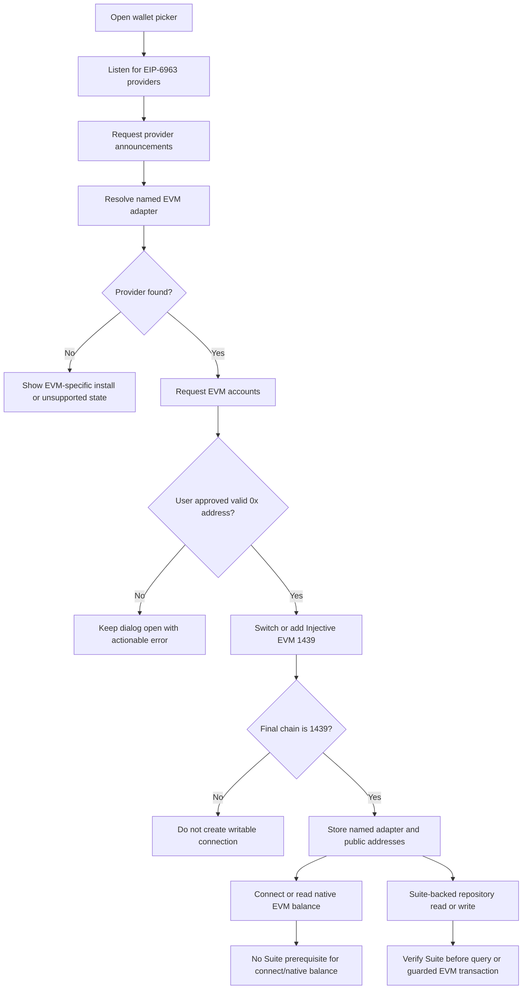

# EVM Wallet Compatibility Plan

- Status: Implemented in Web runtime; live wallet acceptance pending
- Scope: Web wallet connection and EVM transaction compatibility
- Target network: Injective EVM testnet, chain ID `1439` (`0x59f`)
- Product decision: Support wallets that can sign the current Injective EVM
  transaction path. Do not restore the V1 Cosmos/CosmWasm write path.

## Purpose

The EVM V2 Web application must let a user choose an injected wallet that can
connect to Injective EVM, switch or add chain `1439`, and sign the existing
legacy type-0 EVM transactions. The application already presents repository
owners as `inj1...` addresses, but that display conversion does not turn a
Cosmos signer into an EVM transaction signer.

This plan makes wallet support a capability promise rather than a logo list.
A wallet is only called supported after it has passed the defined discovery,
connection, network-management, signing, and receipt checks.

## Decisions And Boundaries

### Accepted Scope

- The ordinary Web write path stays EVM-only and uses the existing `viem` plus
  EIP-1193 provider path.
- Provider discovery prefers EIP-6963 announcements and uses narrowly scoped
  vendor injection fallbacks only where they identify one wallet unambiguously.
- The Web may show a wallet only when an EIP-1193-compatible provider is
  discovered. A detected provider must still pass live acceptance before the
  wallet is advertised as supported.
- The connection flow requests an account, ensures Injective EVM chain `1439`,
  derives the display `inj1...` address from that EVM account, and retains the
  provider identity for all later writes.
- Connect remains independent from `SuiteDirectory` verification. Repository
  reads and writes continue to fail closed when the Suite is not configured or
  does not verify.
- All writes retain the current single-provider in-flight lock, explicit
  legacy type-0 transaction policy, gas estimation, minimum gas price, and
  receipt confirmation behavior.

### Explicit Non-Goals

- Do not restore native Cosmos signing (`window.keplr.enable`, `getOfflineSigner`,
  `signDirect`, CosmJS, or V1 `MsgExecuteContract` writes). Keplr is considered
  only through its documented `window.keplr.ethereum` EVM provider.
- Do not use a V1 fallback, a dual-write mode, a relayer, or a Cosmos-to-EVM
  bridge as part of this work.
- Do not add WalletConnect/Reown or mobile deep-link support in the first
  compatibility release. It is a separate EVM session product decision.
- Do not select an arbitrary `window.ethereum` provider merely because one is
  present. Multiple extensions can inject concurrently, and choosing the
  wrong provider is a signing-risk and user-experience failure.
- Do not declare Keplr or Leap supported merely because they expose native
  Cosmos APIs or an `inj1...` account. They are candidates only if a tested
  EVM provider exposes the methods required by this plan. Leap's documented
  browser EVM surface is the Compass provider (`window.compassEvm`), not the
  native `window.leap` Cosmos API.
- Do not ask for, import, log, persist, or transmit a seed phrase, private key,
  or wallet secret.

## Current Baseline

The ordinary Web runtime currently has one EVM connection model:

1. `SUPPORTED_WALLETS` identifies MetaMask, Rabby, OKX Wallet, Bitget, Trust,
   Coinbase Wallet, Brave Wallet, Keplr (EVM), and Compass (Leap EVM).
2. `getEvmProvider` resolves a named EIP-1193 provider.
3. The context calls `eth_requestAccounts`, validates a `0x` address, then
   calls `wallet_switchEthereumChain` or, on error `4902`,
   `wallet_addEthereumChain` followed by a second switch.
4. The transaction transport requests the active account again, verifies the
   target chain, estimates gas, sends a legacy EVM transaction, and waits for a
   successful receipt.

The Web implementation now contains EIP-6963 discovery, delayed provider
re-scanning, silent reconnect via `eth_accounts`, and a connection flow that no
longer verifies the Suite before requesting a wallet. A connected session keeps
the selected provider object and EIP-6963 UUID in memory; only the wallet family
ID is persisted. Account, chain, and disconnect events are subscribed on that
same provider, and a replacement or ambiguous provider cannot be substituted
silently. Public native-balance reads continue to use the configured profile
RPC. These source-level guarantees are covered by the Web API test suite, but
they are not a real-wallet compatibility claim until the live acceptance matrix
below has been completed.

### Implemented In This Change

- MetaMask, Rabby, OKX Wallet (EVM), Bitget Wallet, Trust Wallet, Coinbase
  Wallet, Brave Wallet, Keplr (EVM), and Compass (Leap EVM) are exposed through
  the EIP-1193 EVM picker. Keplr is resolved only from `window.keplr.ethereum`,
  and Compass only from the documented `window.compassEvm`, never from native
  Cosmos signer APIs.
- EIP-6963 UUID/RDNS resolution is deterministic, late announcements are
  handled, same-brand ambiguity blocks silent restore, and legacy fallbacks
  reject ambiguous vendor flags.
- Writes from repository, ownership, sponsor, badge, and revenue-split flows
  receive the session-pinned provider from `WalletContext`; no write caller
  re-resolves a provider by family ID.
- `accountsChanged`, `chainChanged`, and `disconnect` update or clear the
  session. A wrong chain remains visible as an account session but is marked
  unwritable until chain `1439` is confirmed again.
- EIP-1193 error codes `4001`, `4100`, `4200`, `4902`, and `-32002` are
  normalized across numeric, string, and nested provider error shapes.
- Automated coverage now includes all listed RDNS mappings, late discovery,
  provider replacement, ambiguity, legacy fallback safety, and event/lifecycle
  source checks. `npm run typecheck`, `npm run test:api`, and `npm run build`
  pass in the Web package.

The checked-in public profile deliberately has no deployed `SuiteDirectory`.
This means that connection and basic network validation can be tested before
cutover, while any real write acceptance requires a separately reviewed,
configured test directory and funded test account. A source fixture or mocked
provider is not a substitute for that acceptance.

## Compatibility Contract

Every supported wallet must satisfy the following contract for Injective EVM
testnet:

| Capability | Required behavior |
|---|---|
| Discovery | Announces through EIP-6963 with the expected RDNS, or is found through an exact vendor-specific fallback. |
| Account access | `eth_requestAccounts` returns one valid `0x` EVM address after user approval. |
| Reconnect | `eth_accounts` can restore an already authorized account without opening a prompt. |
| Network validation | `eth_chainId` reports `0x59f` after setup. |
| Network setup | `wallet_switchEthereumChain` switches to chain `1439`; error `4902` permits `wallet_addEthereumChain` and one retry. |
| Signing | The provider accepts the existing estimated, explicit legacy type-0 transaction shape through `eth_sendTransaction`. |
| Confirmation | The provider returns `eth_getTransactionReceipt` through the current receipt polling path. |
| Events | `accountsChanged` and `chainChanged` do not leave the application showing an authorized, writable account when it is not one. |

The application must not preflight `eth_sendTransaction` only to discover
capability because doing so would prompt the user. A live signed canary is an
acceptance test, not a connection-time probe.

### Provider Resolution Rules

1. Register the EIP-6963 announce listener before dispatching
   `eip6963:requestProvider`.
2. Match announced providers by a reviewed, case-insensitive RDNS allowlist.
3. Retain provider records by UUID so repeated announcements do not change the
   selected provider unexpectedly.
4. Use the vendor-specific fallback only when no matching EIP-6963 provider
   exists for the selected wallet.
5. Never substitute another injected provider after the user chose a wallet.
6. Re-resolve the named provider before a write so a removed extension or
   account change cannot silently send via another wallet.
7. Pin the selected EIP-6963 UUID and provider object for the current session.
   Persist only the wallet family ID across a page reload; if more than one
   matching provider is available after reload, require the user to choose
   again rather than silently selecting a different instance.
8. Treat RDNS as provider-routing metadata, not cryptographic identity. An
   announcement alone must never request accounts, switch networks, or restore
   a writable session without the user's selected wallet and an `eth_accounts`
   confirmation.

### Connection States And Errors

The implementation should represent these states separately, even if the first
UI uses compact text:

| State | User-facing meaning | Required behavior |
|---|---|---|
| Not detected | No matching EVM provider is available. | Offer the vendor install link; do not imply a native Cosmos wallet is usable. |
| Connecting | A permission or chain request is pending. | Disable every connect action until it resolves. |
| Rejected | The wallet rejected account access or network setup. | Keep the dialog open and permit an intentional retry. |
| Network unsupported | The provider cannot add or switch Injective EVM. | Explain that this wallet/version cannot use the EVM transaction path. |
| Wrong network | The active chain remains different after setup. | Do not create a connected writable state. |
| Connected | An authorized account and chain `1439` are confirmed. | Retain the selected provider UUID/object in memory; persist only the wallet family ID and derived public addresses. |
| Write unavailable | The Suite is unconfigured or unverified. | Preserve the wallet connection; block the write with the Suite-specific error. |

Provider error code `4001`, unauthorized code `4100`, unsupported-method code
`4200`, pending-request code `-32002`, the unknown-chain code `4902`, invalid
account responses, a wrong final chain ID, and unsupported methods must result
in distinct actionable messages. The error mapper must normalize a numeric or
numeric-string code whether it arrives at the top level or in a nested provider
error. Raw provider objects, addresses beyond the already displayed public
address, RPC payloads, and transaction internals must not be exposed in
ordinary UI errors.

## Wallet Matrix

The following matrix is a release-planning list, not confirmation that a
particular extension version is compatible. A wallet moves to a supported
release column only after the acceptance matrix passes.

| Wallet family | Intended connector | Initial status | Release rule |
|---|---|---|---|
| MetaMask | EIP-6963 `io.metamask`, then a reviewed exact fallback | Core target | Must pass all browser and signed-canary checks. |
| Rabby | EIP-6963 `io.rabby`, then a reviewed exact fallback | Core target | Must pass all browser and signed-canary checks. |
| OKX Wallet (EVM) | Expected EIP-6963 `com.okex.wallet`; retain a legacy fallback only after real-extension validation | Core target | Must pass all browser and signed-canary checks; UI must say `OKX Wallet (EVM)`. |
| Bitget Wallet | Expected EIP-6963 `com.bitget.web3` or `com.bitkeep.wallet`; retain an exact fallback only after validation | Candidate | Include only after its tested version passes all checks. |
| Trust Wallet | Expected EIP-6963 `com.trustwallet.app`; retain an exact fallback only after validation | Candidate | Include only after its tested version passes all checks. |
| Coinbase Wallet | Expected EIP-6963 `com.coinbase.wallet`; retain an exact fallback only after validation | Candidate | Include only after its tested version passes all checks. |
| Brave Wallet | Expected EIP-6963 `com.brave.wallet`; retain an exact fallback only after validation | Candidate | Include only after its tested version passes all checks. |
| Keplr (EVM) | Exact `window.keplr.ethereum` provider fallback; no Cosmos API | Conditional candidate | Keep conditional until a tested extension version completes the Injective EVM canary and receipt checks. |
| Compass (Leap EVM) | Exact documented `window.compassEvm` fallback or reviewed EIP-6963 announcement | Conditional candidate | Keep conditional until a tested extension version completes the Injective EVM canary and receipt checks. |

The first implementation batch should make MetaMask, Rabby, and OKX Wallet
(EVM) the explicit release target. The remaining currently listed EVM wallets
remain candidates until their real-extension results are recorded.

Keplr's EVM surface is documented at
<https://docs.keplr.app/api/multi-ecosystem-support/evm>; that documentation is
the reason the conditional `Keplr (EVM)` row is implemented, but it is not a
substitute for testing the exact extension version against Injective testnet.

Leap documents its Compass EVM provider at
<https://docs.leapwallet.io/cosmos/for-sei-evm-dapps-connect-to-compass/connect-to-compass>;
the connector uses only the documented EIP-1193 provider object.

## Implementation Plan

### Phase 0: Preserve The Correct Baseline

- Commit and review the existing separation between wallet connection and
  `SuiteDirectory` verification.
- Retain EIP-6963 subscription and re-scan behavior so late-injected providers
  can appear after the modal opens.
- Retain exact vendor fallback paths for providers that do not announce via
  EIP-6963.
- Clear stale `igit-wallet-provider` values that no longer identify a supported
  EVM wallet. Never repeatedly prompt a user for an obsolete Cosmos wallet ID.
- Keep the public profile's SuiteDirectory empty until normal cutover evidence
  permits a published value.

### Phase 1: Introduce A Named EVM Wallet Adapter Boundary

- Extend wallet definitions with reviewed RDNS values, exact legacy resolver
  functions, and the supported EVM capability contract. Keep this data in the
  existing wallet module rather than scattering vendor checks through pages.
- Return a named adapter or typed resolution result instead of a bare provider
  wherever the caller needs to distinguish `not detected` from a bad response.
- Pin the selected EIP-6963 UUID and provider object in the connected session.
  Do not let a later same-brand announcement replace it. The persisted wallet
  family ID is only a reconnect hint, not proof of the same provider instance.
- Ensure the same selected adapter is used for connect, reconnect, provider
  events, ownership actions, sponsorship, and every other module write.
  Public RPC reads, including native-balance refresh, remain on the configured
  profile RPC and must not depend on the injected provider.
- Revalidate `eth_chainId` after `chainChanged`; a wrong network must clear or
  mark the writable session unavailable rather than merely clearing query
  caches.
- On `accountsChanged` with no account, fully disconnect and remove the saved
  wallet ID. On a non-empty change, restore only from the same named adapter.
- On a provider `disconnect` event, when the provider emits one, clear the
  in-memory connection and saved wallet ID. This disconnects the application
  session; it does not claim to revoke wallet-extension permissions.
- Register account, chain, and disconnect listeners only for the session-pinned
  provider. Remove every listener when the provider changes, the session ends,
  or the component unmounts so an obsolete provider cannot mutate new state.
- Preserve the per-provider transaction lock and never launch two writes for
  one account sequence concurrently.

### Phase 2: Improve The Wallet Picker And Failure UX

- Rename the current OKX entry to `OKX Wallet (EVM)` and label every listed
  choice as an EVM connector.
- Replace the generic "No wallet extension" empty state with "No supported EVM
  wallet was detected" so users with a Cosmos-only Keplr installation receive
  an accurate explanation.
- Show installation links only for absent adapters. Show retryable error states
  for a provider that is detected but rejects a request.
- Keep a stable modal layout while detection events arrive; a late provider
  cannot reorder rows, change the selected wallet, or dismiss an error.
- Do not close the dialog until `connect` has completed successfully.
- Keep a connected account visible when repository verification is unavailable,
  but distinguish the later Suite write error from a wallet failure.

### Phase 3: Add Automated Compatibility Coverage

Add source-level tests for all of the following:

- Each approved RDNS maps to its intended wallet ID and cannot satisfy another
  wallet's resolver.
- Exact legacy fallbacks work only for the named provider and do not select an
  arbitrary `window.ethereum` object.
- Multiple simultaneous EIP-6963 announcements retain deterministic provider
  selection. Cover duplicate UUIDs, same RDNS with different UUIDs, and
  multiple injected providers that carry the same vendor flag.
- Announcements that arrive after modal mount update availability without a
  page reload.
- Stale or unsupported saved wallet IDs are removed without triggering account
  access.
- `eth_requestAccounts` rejection, invalid accounts, unknown chain `4902`,
  chain-add rejection, chain-switch rejection, and wrong final chain produce
  the correct state and message. Cover `4001`, `4100`, `4200`, and `-32002`,
  including numeric, numeric-string, and nested provider error shapes.
- `accountsChanged([])` disconnects; a non-empty account update changes the
  displayed `inj1...` address only after the same provider confirms it.
- `chainChanged` prevents writes until chain `1439` is confirmed again.
- A provider `disconnect` event clears the application session without claiming
  to revoke extension permissions.
- Provider removal or component cleanup removes all event listeners; an old
  provider event cannot update a later connection.
- Native-balance refresh uses the configured RPC and does not switch or select
  a wallet provider.
- An unconfigured or unverified Suite write fails before any wallet account or
  transaction request, while connect and native-balance reads remain available.
- Existing legacy transaction, minimum gas-price, receipt-success,
  receipt-uncertainty, and duplicate-write-lock tests remain green.

The source-level suite must continue to run through:

```sh
cd web
npm run test:api
npm run typecheck
npm run build
```

### Phase 4: Run A Real Wallet Acceptance Matrix

Use clean browser profiles and record the extension version, browser version,
operating system, and outcome for each candidate. Do not put secrets, seed
phrases, or private test keys in the record.

For each wallet, exercise:

1. The wallet alone in a clean profile: detection, account approval, and
   connection state.
2. Chain `1439` already configured: successful switch and final chain check.
3. Chain `1439` absent: add-chain confirmation, switch retry, and final chain
   check.
4. User rejection of account access, add-chain, and switch-chain requests.
5. Wallet locked, extension disabled, provider disconnect, and account change
   to an empty account list.
6. The wallet alongside at least one other injected extension, verifying the
   named selection remains stable.
7. A funded account and a reviewed, verified test SuiteDirectory: one bounded
   legacy type-0 write, receipt success, receipt failure/revert handling, and
   balance refresh.

The live write in step 7 is required before a wallet family is shown as
supported in release material. It is separate from source fixtures and must be
retained with the corresponding testnet acceptance evidence once a directory
exists. Its record must bind the exact source commit, browser and operating
system, wallet and extension version, discovery source (EIP-6963 UUID/RDNS or
reviewed fallback), chain-add result, verified SuiteDirectory result, public
transaction hash, receipt, and block-explorer URL. It must demonstrate chain
`1439`, transaction type `0x0`, estimated gas with the current headroom,
explicit gas price of at least `160000000 wei`, and a successful receipt.

### Phase 5: Release Decision

Promote only wallet families with a complete passing acceptance record. For a
candidate that fails any required capability, either remove it from the picker
or mark it unavailable with an accurate EVM-specific explanation. Do not keep a
brand in the primary picker solely because a historical Cosmos integration once
existed.

Before release, verify:

- The selected provider cannot be replaced by a different injected extension.
- A connection works without an active SuiteDirectory, while writes still fail
  closed without one.
- All supported wallets sign the current legacy type-0 transaction shape and
  return `eth_getTransactionReceipt` confirmation on chain `1439`.
- A provider rejection, wrong chain, extension removal, account removal, and
  receipt uncertainty leave no false successful state.
- UI copy never promises native Cosmos/Keplr signing for the EVM V2 path.
- The exact reviewed commit has green Web checks and the manual compatibility
  matrix is attached to the release review.

## Flow And Trust Boundary



The wallet provider is trusted only to expose the user-selected account and
sign the user-confirmed transaction. The application continues to verify the
EVM chain, SuiteDirectory bindings, module code hashes, gas policy, receipt
status, and transaction serialization independently.

## Risks And Controls

| Risk | Control |
|---|---|
| Multiple extensions overwrite or share `window.ethereum` | EIP-6963-first discovery, RDNS allowlists, exact fallbacks, session-pinned UUID/provider identity, and no generic provider fallback. |
| Wallet support differs by extension version | Record actual version/browser acceptance and avoid unsupported marketing claims. |
| A native Cosmos wallet is mistaken for an EVM signer | EVM-specific labels and explicit exclusion of Cosmos APIs from the ordinary write path. |
| No public SuiteDirectory exists yet | Decouple connect from Suite verification; defer real write acceptance until reviewed test evidence exists. |
| A wallet cannot add or switch Injective EVM | Distinguish unsupported network management from provider absence and keep the session unwritable. |
| Account or network changes leave stale authorization | Handle both provider events, revalidate the named provider and chain, and clear saved state on an empty account list. |
| Duplicate clicks race an EVM account sequence | Preserve the current per-provider transaction lock across every module action. |
| Sensitive wallet material leaks during diagnostics | Store only public wallet ID/address state; redact provider errors and never request secrets. |

## Deferred Decisions

- Decide whether WalletConnect/Reown is needed for mobile OKX and other mobile
  wallets after browser-extension compatibility is accepted.
- Choose the supported browser and extension-version floor after the first live
  matrix establishes reliable combinations.
- Promote Keplr (EVM) or Compass (Leap EVM) only after their exact provider and
  extension version pass this Injective EVM transaction contract. Any native
  Cosmos support still requires a separate approved protocol and security
  design.

## Completion Definition

This plan is complete only when:

1. The first release wallet list contains only families that passed every item
   in the compatibility contract and real acceptance matrix.
2. Connect, disconnect, reconnect, account changes, chain changes, error
   states, and module writes use the same session-pinned EIP-1193 provider.
   Public RPC reads remain independent of that provider.
3. The Web test suite, typecheck, and production build pass on the exact
   reviewed commit.
4. A reviewed testnet record demonstrates a confirmed current EVM transaction
   for each released wallet family, without exposing secrets.
5. No ordinary Web path restores V1 Cosmos/CosmWasm signing or weakens the
   EVM Suite's fail-closed write verification.
