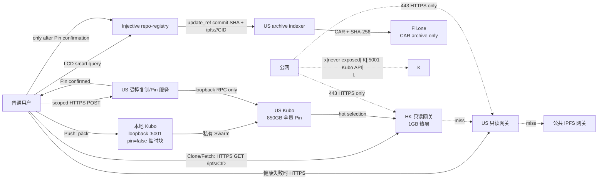

# 目标拓扑与迁移方案

本文描述 iGit 的目标架构，和 [`infrastructure.md`](./infrastructure.md) 中已经部署的 as-built 状态分开维护。只有完成实际部署、验证和监控切换后，才应更新 as-built 文档。

当前迁移状态：US 受控复制数据面已 staged 部署并通过授权/Pin/hash/JTI 验收；
主网合约、正式身份签发、TTL reaper 和 post-`update_ref` GC 仍是发布前待办。

## 目标拓扑

职责边界：HK 只读、缓存新内容 14 天/热门/手工重要 CID，不能确认 Push 成功；US 是唯一持久化写入确认点，保留所有已 Pin CID并负责归档；Fil.one 只保存 CAR，不作为 Git 客户端源；用户长期保存 Git 工作区和链上 refs 中的 CID。

## Push 状态机

1. 本地 Git 生成增量 pack，计算 SHA-256。
2. 本地 Kubo `add?pin=false`，仅获得临时 CID；随后与 US Kubo 建立 Swarm 连接。
3. 客户端用身份 token 调用 `/v1/upload-authorizations`，换取短期 Bearer/JWT ticket；ticket 绑定用户、CID、仓库、ref、pack SHA-256、大小和过期时间。再调用 `/v1/replications`，服务执行限流、配额、单次 JTI 幂等保护，并审计请求。
4. US 服务从来源抓取 CID、递归 Pin，并重新计算 pack SHA-256；未确认 Pin 不返回成功。
5. 客户端收到 Pin 确认后才签名广播 `update_ref`。服务绝不代替用户提交或篡改合约 ref。
6. 交易成功后本地执行 `repo gc`；交易失败保留本地临时块以便重试。US 对未被链上 `update_ref` 引用的 Pin 按 TTL 回收。
7. US 归档索引器扫描链上 refs，导出 CAR 到 Fil.one 并校验 SHA-256。

## 安全与运维

- Kubo `:5001` 和原生 gateway 仅绑定 `127.0.0.1`；nginx 只发布 HTTPS `/ipfs/<cid>`、`/healthz` 和受控复制 POST 路由。
- `/v1/replications` 不是 Kubo API：要求短期授权，绑定 CID/仓库/ref/pack SHA-256/过期时间，限制单用户/单仓库速率和大小，记录审计日志。
- 身份 token 由受信任的认证服务签发（`kind=identity`、`sub`、`exp`）；US 服务只用它签发一次性 `kind=replication` ticket。认证服务与 US 服务必须安全共享验证密钥，且绝不能把该密钥、Kubo RPC 地址或 SSH 密钥下发到客户端。
- `scripts/replication-install.sh` 安装服务及每小时 TTL reaper；`scripts/replication.env.example` 是不含真实密钥的配置模板。
- `scripts/replication-config-check.sh` 在安装和 systemd 启动前 fail-closed 校验配置：启用 reaper 必须使用 `injective-1`、HTTPS 主网 LCD、真实 `inj1...` 合约地址和非占位的至少 32 字符 HMAC；`--no-reaper` 仅允许 staged 数据面。
- `scripts/replication-monitor.sh` 输出 Prometheus textfile 指标，覆盖上传失败率、待 TTL 回收 Pin、24 小时回收数和 US Kubo 容量；归档监控继续覆盖 Fil.one CAR 数量和 SHA-256 校验失败。

## 迁移顺序

1. 先在 US 部署 `igit-replicationd`、loopback-only Kubo 和 nginx 路由，配置 JWT HMAC、限流/大小上限与 TTL reaper。
2. 为客户端签发 CID-bound 短期授权，并设置 `upload.endpoint`、`upload.us_peer`；不要把 Kubo SSH 私钥或 RPC 地址暴露给用户。
3. 发布新 CLI，先验证无本地 Kubo 的 clone/fetch、HK 故障回退 US/公共网关、US Pin 确认和失败重试。
4. 验证成功 Push 后本地 `repo gc` 不保留临时 pack，US 未上链 Pin 能被 reaper 回收，Fil.one CAR SHA-256 与本地一致。
5. 完成真实部署和监控切换后，再在 as-built 文档记录日期、版本、端点和容量；迁移期间保留旧文档中的实际状态。
